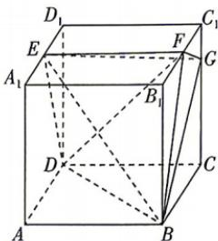

<!-- question-source:start -->
3.[天津2025·17,15分]如图,正方体ABCD- $A_{1}B_{1}C_{1}D_{1}$ 的棱长为4,E,F分别为 $A_{1}D_{1},B_{1}C_{1}$ 的中点, $CG = 3C_1G$ (1)求证: $GF \perp$ 平面EBF；(2)求平面EBF与平面EBG夹角的余弦值；(3)求三棱锥 $D - BEF$ 的体积.

<!-- question-source:end -->
