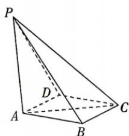

<!-- question-source:start -->
4.[全国新课标Ⅰ2024·17,15分]如图,四棱锥P-ABCD中, $PA\perp$ 底面ABCD,PA=AC=2,BC=1, $AB=\sqrt{3}$ .
(1) 若 $AD \perp PB$ , 证明: AD // 平面 PBC;
(2) 若 $AD \perp DC$ , 且二面角 A-CP-D 的正弦值为 $\frac{\sqrt{42}}{7}$ , 求 AD.

<!-- question-source:end -->
