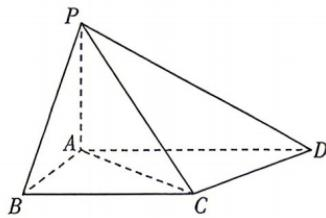

<!-- question-source:start -->
6.[全国一2025·17,15分]如图,在四棱锥P-ABCD中, $PA\perp$ 底面ABCD, $AB\perp AD$ ,BC//AD.
(1)证明:平面 $PAB\perp$ 平面PAD;
(2)设 $PA=AB=\sqrt{2}$ , BC=2; $AD=1+\sqrt{3}$ ，且点P,B,C,D均在球O的球面上.
(i)证明:点O在平面ABCD内;
(ii)求直线AC与PO所成角的余弦值.

√ 答案 P130

(2) 若 $\angle AOB = 90^{\circ}, P, Q$ 是圆 $O_{1}$ 上的两个动点, $\angle PO_{1}Q = 90^{\circ}$ , 圆台 $OO_{1}$ 的高为 $h$ , 是否存在一个给定的 $h$ , 使 $P, Q$ 运动到某个特定的位置时, 平面 $PAB \perp$ 平面 $QAB$ ? 若存在, 求出 $h$ 的值; 若不存在, 请说明理由.
<!-- question-source:end -->
