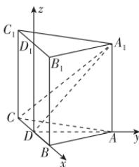

> [!faq]- 答案与解析
>
> > [!success]- **【答案】** BD
>
> > [!note]- **【解析】**
> > BD 【解析】取 $B_{1}C_{1}$ 的中点 $D_{1}$ ，连接 $DD_{1}$ ，由正三棱柱的性质知 BC, AD, $DD_{1}$ 两两垂直，则建立如图所示的空
> >
> > 
> >
> > 间直角坐标系 D-xyz，设正三棱柱 $ABC-A_{1}B_{1}C_{1}$ 的高为 h(h>0)，底面边长为 2，则 $D(0,0,0)$ ， $A(0,\sqrt{3},0)$ ， $A_{1}(0,\sqrt{3},h)$ ， $B(1,0,0)$ ， $B_{1}(1,0,h)$ ， $C(-1,0,0)$ ， $C_{1}(-1,0,h)$ 。
> > 对于 A，由于 $\overrightarrow{AD}=(0,-\sqrt{3},0)$ ， $\overrightarrow{A_{1}C}=(-1,-\sqrt{3},-h)$ 则 $\overrightarrow{AD}\cdot\overrightarrow{A_{1}C}=0\times(-1)+(-\sqrt{3})\times(-\sqrt{3})+0\times(-h)=3\neq0,\therefore AD$ 与 $A_{1}C$ 不垂直，故 A 错误；
> > 对于 B, D, 由于 $\overrightarrow{B_{1}C_{1}}=(-2,0,0)$ ， $\overrightarrow{CC_{1}}=(0,0,h)$ ，平面 $AA_{1}D$ 的一个法向量为 $\overrightarrow{DB}=(1,0,0)$ ，又 $\overrightarrow{B_{1}C_{1}}//\overrightarrow{DB},\overrightarrow{CC_{1}}\cdot\overrightarrow{DB}=0\times1+0\times0+h\times0=0$ ，且 $CC_{1}\not\subset$ 平面 $AA_{1}D,\therefore B_{1}C_{1}\perp$ 平面 $AA_{1}D,CC_{1}//$ 平面 $AA_{1}D$ ，故 B, D 正确；
> > 对于 C，由于 $\overrightarrow{A_{1}B_{1}}=(1,-\sqrt{3},0)$ ，而 $\overrightarrow{AD}=(0,-\sqrt{3},0)$ ，显然 $\overrightarrow{A_{1}B_{1}}$ 与 $\overrightarrow{AD}$ 不共线，∴ AD 与 $A_{1}B_{1}$ 不平行，故 C 错误. 故选 BD.
> >
> > 多种解法 对于 A, 由正三棱柱的性质可知, $AA_{1} \perp$ 平面 ABC, 又 $AD \subset$ 平面 ABC, 则 $AA_{1} \perp AD$ , 假设 $AD \perp A_{1}C$ , 又 $AA_{1} \cap A_{1}C = A_{1}, AA_{1}, A_{1}C \subset$ 平面 $AA_{1}C_{1}C$ , 所以 $AD \perp$ 平面 $AA_{1}C_{1}C$ , 又 $AC \subset$ 平面 $AA_{1}C_{1}C$ , 所以 $AD \perp AC$ , 矛盾, 所以 $AD$ 与 $A_{1}C$ 不垂直, 故 A 错误.
> >
> > 对于 B, 因为 $AA_{1} \perp$ 平面 ABC, BC ⊂ 平面 ABC, 所以 $AA_{1} \perp BC$ . 又 $AD \perp BC, AD \cap AA_{1} = A, AD, AA_{1} \subset$ 平面 $AA_{1}D$ , 所以 $BC \perp$ 平面 $AA_{1}D$ , 又 $B_{1}C_{1} // BC$ , 所以 $B_{1}C_{1} \perp$ 平面 $AA_{1}D$ , 故 B 正确.
> >
> > 对于 C, 因为 $AB // A_{1}B_{1}, AB, A_{1}B_{1} \subset$ 平面 $ABB_{1}A_{1}, AD \cap$ 平面 $ABB_{1}A_{1} = AD \cap$ 而 $\frac{3\sqrt{2}}{4} < \frac{3}{2}$ , 故 $H$ 在平面 $PBC$ 内的轨迹是半径为 $\sqrt{\left(\frac{3}{2}\right)^2 - \left(\frac{3\sqrt{2}}{4}\right)^2} = \frac{3\sqrt{2}}{4}$
> >
> > ## 第一章高考强化
> >
> > $AB = A$ ，所以 $AD$ 与 $A_{1}B_{1}$ 异面，故C错误.对于D，因为 $CC_1 / / AA_1,AA_1\subset$ 平面 $AA_{1}D,CC_{1}\not\subset$ 平面 $AA_{1}D$ ，所以 $CC_1 / /$ 平面 $AA_{1}D$ ，故D正确.故选BD.
> >
> > 链接教材 本题是教材第48页复习参考题1第7题的变式与延伸，在正三棱柱中考查线面位置关系的证明问题，可以利用正三棱柱自身特性建立空间直角坐标系，写出各个点的坐标，根据点的坐标求出相应线段的方向向量和平面的法向量，判断线线、线面的位置关系.
