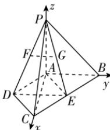

> [!faq]- 答案与解析
>
> > [!success]- **【答案】** (1)
>
> > [!note]- **【解析】**
> > 【证明】连接 DE, AE, 如图.
> > ∵ F, G 分别为线段 PD, PE 的中点,
> > ∴ FG//DE.
> > ∵ △ABC 与△ADC 均为等腰直角三角形, ∠BAC=90°, ∠ADC=90°,
> > ∴ AD=DC=CE=AE 且 ∠AEC=90°,
> > ∴ 四边形 ADCE 为正方形,
> > ∴ DE⊥AC,
> > 又 AB⊥AC, DE, AB, AC⊂平面 ABCD,
> > ∴ DE//AB.
> > ∴ FG//AB,
> > 又 FG∉平面 PAB, AB⊂平面 PAB,
> > ∴ FG//平面 PAB.
> >
> > (2)【解】∵ $PA \perp$ 平面 ABCD, $AB \perp AC$ , ∴ 以点 A 为坐标原点, AC, AB, AP 所在直线分别为 x, y, z 轴建立如图所示的空间直角坐
> >
> > 
> >
> > 标系，
> > 又 PA = AC，设 PA = a，则 A(0,0,0)， $P(0,0,a)$ ， $B(0,a,0)$ ， $C(a,0,0)$ ， $D\left(\frac{a}{2},-\frac{a}{2},0\right)$ ∴ $\overrightarrow{AB} = (0, a, 0)$ ， $\overrightarrow{CD} = \left(-\frac{a}{2}, -\frac{a}{2}, 0\right)$ ， $\overrightarrow{PC} = (a, 0, -a)$ .
> > 设平面 PCD 的法向量为 $\boldsymbol{n}=(x,y,z)$ ，
> > 则 $\left\{\begin{aligned}\boldsymbol{n}\cdot\overrightarrow{CD}&=0,\\ \boldsymbol{n}\cdot\overrightarrow{PC}&=0,\end{aligned}\right.$ 即 $\left\{\begin{aligned}-\frac{a}{2}\cdot x-\frac{a}{2}\cdot y&=0,\\ ax-az&=0,\end{aligned}\right.$ 令 x=1，得 y=-1, z=1，
> > ∴ $n=(1,-1,1)$ .
> >
> > 的圆，故存在符合题意的点 $H$ ，此时点 $H$ 的轨迹是半径为 $\frac{3\sqrt{2}}{4}$ 的圆.
> >
> > 则 $\cos\langle\overrightarrow{AB},n\rangle=\frac{\overrightarrow{AB}\cdot n}{|\overrightarrow{AB}|\cdot|n|}=$ $\frac{-a}{a\cdot\sqrt{3}}=-\frac{\sqrt{3}}{3},$ ∴ 直线 AB 与平面 PCD 所成角的正弦值为 $\frac{\sqrt{3}}{3}$ .
> >
> > 多种解法（2）由（1）知， $DE \parallel AB$ ，
> > ∴ 直线 AB 与平面 PCD 所成的角即为直线 DE 与平面 PCD 所成的角.
> > ∵ PA = AC, 不妨设 DC = AD = a, 则 $DE = \sqrt{2}a, AC = PA = \sqrt{2}a,$ ∴ $S_{\triangle DCE} = \frac{1}{2}a^{2}.$ ∴ $V_{P-DCE} = \frac{1}{3} \cdot AP \cdot S_{\triangle DCE} = \frac{1}{3} \times \sqrt{2}a \times \frac{1}{2}a^{2} = \frac{\sqrt{2}}{6}a^{3}.$ ∵ $PD = \sqrt{AP^{2} + AD^{2}} = \sqrt{3}a, DC = a, PC = \sqrt{PA^{2} + AC^{2}} = 2a,$ ∴ $PD^{2} + DC^{2} = PC^{2}, \therefore PD \perp DC,$ ∴ $S_{\triangle PDC} = \frac{1}{2} \cdot PD \cdot DC = \frac{\sqrt{3}}{2}a^{2}.$ 设点 E 到平面 PCD 的距离为 h，
> > 则 $h = \frac{3V_{P-DCE}}{S_{\triangle PDC}} = \frac{3 \times \frac{\sqrt{2}}{6} a^{3}}{\frac{\sqrt{3}}{2} a^{2}} = \frac{\sqrt{6}}{3}a.$ 设直线 DE 与平面 PCD 所成的角为 $\theta,$ 则 $\sin\theta=\frac{h}{DE}=\frac{\frac{\sqrt{6}}{3}a}{\sqrt{2}a}=\frac{\sqrt{3}}{3},$ ∴ 直线 AB 与平面 PCD 所成角的正弦值为 $\frac{\sqrt{3}}{3}.$
