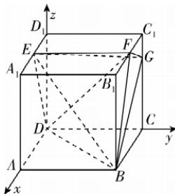

> [!faq]- 答案与解析
>
> > [!success]- **【答案】** （1）
>
> > [!note]- **【解析】**
> > 【证明】由题可知 $A_{1}B_{1}\perp$ 平面 $BCC_{1}B_{1},EF / / A_{1}B_{1}$ ，所以 $EF\bot$ 平面 $BCC_{1}B_{1}$ 又因为 $GF\subset$ 平面 $BCC_{1}B_{1}$ ，所以 $GF\bot EF.$ 在 $\mathrm{Rt}\triangle GC_1F$ 中， $GC_{1} = \frac{1}{4} CC_{1} = 1$ $FC_{1} = \frac{1}{2} B_{1}C_{1} = 2,$ 所以 $FG = \sqrt{1^2 + 2^2} = \sqrt{5} .$ 在 $\mathrm{Rt}\triangle BB_1F$ 中， $BB_{1} = 4,B_{1}F =$ $\frac{1}{2}B_{1}C_{1}=2$ , 所以 $BF=\sqrt{4^{2}+2^{2}}=2\sqrt{5}$ .
> > 在 Rt $\triangle BCG$ 中，BC = 4，CG = $\frac{3}{4}CC_{1}=3$ 所以 $BG = \sqrt{4^{2} + 3^{2}} = 5$ .
> > 则 $BG^{2}=FG^{2}+BF^{2}=25$ ，所以 $BF \perp GF$ .
> > → 点 悟：要善于利用题目中的数据
> > “算垂直”，即由“定量”到定性
> > 因为 $GF \perp EF, GF \perp BF$ ，且 $BF \cap EF = F, BF, EF \subset$ 平面 EBF，所以 $GF \perp$ 平面 EBF.
> >
> > (2)【解】如图,以 D 为原点建立空间直角坐标系,则 $B(4,4,0)$ , $E(2,0,4)$ , $F(2,4,4)$ , $G(0,4,3)$ ,
> > 所以 $\overrightarrow{FG}=(-2,0,-1)$ , $\overrightarrow{EG}=(-2,4,-1)$ , $\overrightarrow{BG}=(-4,0,3)$ ,
> > 由(1)知 $\overrightarrow{FG}$ 是平面 EBF 的一个法向量,
> > 设平面 EBG 的法向量为 $\boldsymbol{n}=(x,y,z)$ ，所以 $\left\{\begin{aligned}\boldsymbol{n}\cdot\overrightarrow{EG}&=-2x+4y-z=0,\\ \boldsymbol{n}\cdot\overrightarrow{BG}&=-4x+3z=0,\end{aligned}\right.$ 令 x=6，则 z=8,y=5，即 $\boldsymbol{n}=(6,5,8)$ .
> > 设平面 EBF 与平面 EBG 的夹角为 $\alpha$ ，
> > 则 $\cos\alpha=|\cos\langle\overrightarrow{FG},\boldsymbol{n}\rangle|=\frac{|\overrightarrow{FG}\cdot\boldsymbol{n}|}{|\overrightarrow{FG}||\boldsymbol{n}|}=\frac{20}{\sqrt{5}\times\sqrt{125}}=\frac{4}{5}.$ (3)由(1)知 $EF \perp$ 平面 $BCC_{1}B_{1}$ , $FB \subset$ 平面 $BCC_{1}B_{1}$ ，所以 $EF \perp FB$ ,
> > 易知 $S_{\triangle BEF}=\frac{1}{2}EF\cdot BF=\frac{1}{2}\times4\times\sqrt{4^{2}+2^{2}}=4\sqrt{5}$ ,
> > 又 $\overrightarrow{DE}=(2,0,4)$ ，平面 EBF 的一个法向量为 $\overrightarrow{FG}=(-2,0,-1)$ ，则 D 到平面 EBF 的距离 $d=\frac{|\overrightarrow{DE}\cdot\overrightarrow{FG}|}{|\overrightarrow{FG}|}=\frac{8}{\sqrt{5}}$ 由棱锥的体积公式知 $V_{D-BEF}=\frac{1}{3}d\times S_{\triangle BEF}=\frac{1}{3}\times\frac{8}{\sqrt{5}}\times4\sqrt{5}=\frac{32}{3}.$
> >
> > 
