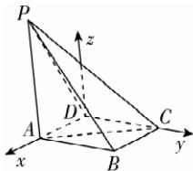

> [!faq]- 答案与解析
>
> > [!success]- **【答案】** (1)
>
> > [!note]- **【解析】**
> > 【证明】由 $BC = 1, AB = \sqrt{3}, AC = 2$ 可得， $AC^2 = AB^2 + BC^2, \therefore AB \perp BC.$ 又 $PA \perp$ 底面ABCD, $BC \subset$ 底面ABCD, $\therefore BC \perp PA.$ 又 $AB \cap PA = A, AB, PA \subset$ 平面PAB，
> >
> > ∴ BC ⊥ 平面 PAB.
> > → 散黑板：要着力寻找平面内的两条相交直线
> > ∵ PA ⊥ 底面 ABCD, AD ⊂ 底面 ABCD, ∴ AD ⊥ PA.
> > 又 AD ⊥ PB，且 PB ∩ PA = P, PB, PA ⊂ 平面 PAB，
> > ∴ AD ⊥ 平面 PAB, ∴ AD // BC.
> > → 点悟：垂直于同一个平面的两直线平行
> > 又 BC ⊂ 平面 PBC, AD ∉ 平面 PBC,
> > ∴ AD // 平面 PBC.
> > (2)【解】以 D 为坐标原点, DA, DC 所在直线分别为 x, y 轴, 过点 D 且垂直于平面 ABCD 的直线为 z 轴, 建立如图所示的空间直角坐标系, 则 D(0,0,0),
> >
> > 
> >
> > 设 $A(x,0,0)$ $(0 < x < 2)$ ，则 $P(x,0,2),C(0,\sqrt{4 - x^2},0)$ . 则 $\overrightarrow{AC} = (-x,\sqrt{4 - x^2},0),\overrightarrow{AP} = (0,0,2),\overrightarrow{DC} = (0,\sqrt{4 - x^2},0),\overrightarrow{DP} = (x,0,2)$ . 设平面 $ACP$ 的法向量为 $\pmb{n}_1 = (x_1,y_1,z_1)$ ，则 $\left\{ \begin{array}{l}\pmb{n}_1\cdot \overrightarrow{AC} = 0,\\ \pmb{n}_1\cdot \overrightarrow{AP} = 0, \end{array} \right.$ 即 $\left\{ \begin{array}{l}x_{1}\cdot (-x) + y_{1}\cdot \sqrt{4 - x^{2}} = 0,\\ 2z_{1} = 0, \end{array} \right.$ 令 $y_{1} = x$ 则 $x_{1} = \sqrt{4 - x^{2}},\therefore \pmb{n}_{1} = (\sqrt{4 - x^{2}},x,0)$ . 设平面 $CPD$ 的法向量为 $\pmb{n}_2 = (x_2,y_2,z_2)$ ，则 $\left\{ \begin{array}{l}\pmb{n}_2\cdot \overrightarrow{DC} = 0,\\ \pmb{n}_2\cdot \overrightarrow{DP} = 0, \end{array} \right.$ 即 $\left\{ \begin{array}{l}y_2\cdot \sqrt{4 - x^2} = 0,\\ x_2x + 2z_2 = 0, \end{array} \right.$ 令 $z_{2} = x$ ，则 $x_{2} = -2$ ∴ $\pmb{n}_2 = (-2,0,x)$ . 设二面角 $A - CP - D$ 的平面角为 $\theta$ 则 $|\cos \theta | = \frac{|n_1\cdot n_2|}{|n_1|\cdot|n_2|} =$ $\frac{2\sqrt{4 - x^2}}{2\sqrt{x^2 + 4}} = \frac{\sqrt{4 - x^2}}{\sqrt{x^2 + 4}}$ 则 $\sin^2\theta = 1 - \cos^2\theta = 1 - \frac{4 - x^2}{x^2 + 4} = \left(\frac{\sqrt{42}}{7}\right)^2,$ 解得 $x = \sqrt{3}$ （负值舍去）.即 $AD$ 的长为 $\sqrt{3}$
