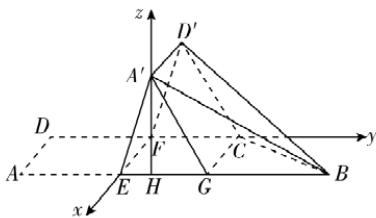

> [!faq]- 答案与解析
>
> > [!success]- **【答案】** (1)
>
> > [!note]- **【解析】**
> > 【证明】如图,过 C 作 CG//EF 交 EB 于 G,连接 A'G. 因为 EF//AD,AB//CD, $\angle DAB=90^{\circ}$ ,所以四边形 ADFE 为矩形,四边形 EFCG 为矩形,所以 $EF\parallel AD,EF\parallel CG$ ,所以 $CG\parallel AD$ ,所以 $CG\parallel A'D'$ ,所以四边形 A'D'CG 为平行四边形.
> > 所以 $CD^{\prime} \parallel A^{\prime}G$ ，又 $A^{\prime}G \subset$ 平面 $A^{\prime}BE$ ， $CD^{\prime} \not\subset$ 平面 $A^{\prime}BE$ ，所以 $CD^{\prime} \parallel$ 平面 $A^{\prime}BE$ .
> > 因为 $CF \parallel EB, EB \subset$ 平面 $A^{\prime}BE, CF \not\subset$ 平面 $A^{\prime}BE$ ，所以 $CF \parallel$ 平面 $A^{\prime}BE$ .
> > 又 $CD'$ , $CF \subset$ 平面 $CD'F, CD' \cap CF = C$ , 所以平面 $CD'F \parallel$ 平面 $A^{\prime}BE$ .
> > 因为 $A^{\prime}B \subset$ 平面 $A^{\prime}BE$ ，所以 $A^{\prime}B \parallel$ 平面 $CD'F.$
> >
> > 
> >
> > (2)【解】因为 $A'E \perp EF, BE \perp EF$ ，所以由二面角的定义可知， $\angle A'EB$ 即为平面 $EFD'A'$ 与平面 $EFCB$ 所成的二面角，所以 $\angle A'EB = 60^\circ$ ，同理 $\angle D'FC = 60^\circ$ 。又 $D'F = DF = FC$ ，所以 $\triangle D'FC$ 为等边三角形。过 $A'$ 作 $A'H \perp EB$ 交 $EB$ 于 $H$ 。因为 $EF \perp EB, EF \perp A'E, A'E \cap EB = E, A'E, EB \subset$ 平面 $A'EB$ ，所以 $EF \perp$ 平面 $A'EB$ ，又 $A'H \subset$ 平面 $A'EB$ ，所以 $EF \perp A'H$ 。又 $A'H \perp EB, EB \cap EF = E, EB, EF \subset$ 平面 $EFCB$ ，所以 $A'H \perp$ 平面 $EFCB$ 。因此以 $F$ 为坐标原点，直线 $FE$ 、直线 $FC$ 、过点 $F$ 且平行于 $A'H$ 的直线分别为 $x$ 轴、 $y$ 轴、 $z$ 轴建立如图所示的空间直角坐标系。
> >
> > 不妨设 $AD = 1$ ，则 $F(0,0,0), E(1,0,0), B(1,2,0), C(0,1,0), D'\left(0, \frac{1}{2}, \frac{\sqrt{3}}{2}\right)$ ，所以 $\overrightarrow{BC} = (-1, -1, 0), \overrightarrow{CD'} = \left(0, -\frac{1}{2}, \frac{\sqrt{3}}{2}\right), \overrightarrow{FE} = (1,0, 0), \overrightarrow{FD'} = \left(0, \frac{1}{2}, \frac{\sqrt{3}}{2}\right)$ 。
> >
> > 设平面 $BCD'$ 的法向量为 $m = (x_1, y_1, z_1)$ ，
> >
> > 则 $\begin{cases} m \cdot \overrightarrow{BC} = -x_1 - y_1 = 0, \\ m \cdot \overrightarrow{CD'} = -\frac{1}{2} y_1 + \frac{\sqrt{3}}{2} z_1 = 0, \end{cases}$ 令 $x_1 = 1$ ，则 $m = \left(1, -1, -\frac{\sqrt{3}}{3}\right)$ 。
> >
> > 设平面 $EFD'A'$ 的法向量为 $n = (x_2, y_2, z_2)$ ，
> >
> > 则 $\begin{cases} n \cdot \overrightarrow{FE} = x_2 = 0, \\ n \cdot \overrightarrow{FD'} = \frac{1}{2} y_2 + \frac{\sqrt{3}}{2} z_2 = 0, \end{cases}$ 令 $y_2 = 1$ ，则 $n = \left(0, 1, -\frac{\sqrt{3}}{3}\right)$ 。
> >
> > 所以 $\cos \langle m, n \rangle = \frac{m \cdot n}{|m||n|} = [120]$ $\frac{-1 + \frac{1}{3}}{\sqrt{\frac{7}{3}} \times \sqrt{\frac{4}{3}}} = -\frac{\sqrt{7}}{7}$ , 所以 $\sin \langle m, n \rangle = \frac{\sqrt{42}}{7}$ , 即平面 $BCD'$ 防坑: 二面角的取值范围为 $[0, \pi]$ , 正弦值始终为非负值与平面 $EFD'A'$ 所成二面角的正弦值为 $\frac{\sqrt{42}}{7}$ .
