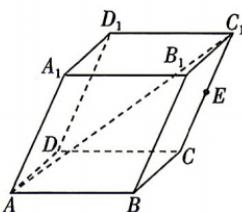

<!-- question-source:start -->
3. 如图, 在平行六面体 $ABCD - A_{1}B_{1}C_{1}D_{1}$ 中, $AB = AD = AA_{1} = 1$ , $\angle BAD = \angle A_{1}AB = \angle A_{1}AD = 60^{\circ}$ , $E$ 为 $CC_{1}$ 的中点, 则点 $E$ 到直线 $AC_{1}$ 的距离为
A. $\frac{2\sqrt{3}}{3}$ B. $\frac{\sqrt{3}}{3}$ C. $\frac{\sqrt{3}}{5}$

$AC_{1}$ 的距离为 （）A. $\frac{2\sqrt{3}}{3}$ B. $\frac{\sqrt{3}}{3}$ C. $\frac{\sqrt{3}}{5}$ D. $\frac{\sqrt{3}}{6}$

## 题型 2 用空间向量研究点面距
<!-- question-source:end -->
