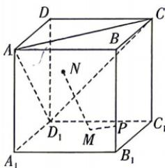

<!-- question-source:start -->
6.[湖北孝感部分学校2025高二联考]在棱长为4的正方体 $ABCD - A_{1}B_{1}C_{1}D_{1}$ 中， $M,N$ 分别是平面 $A_{1}B_{1}C_{1}D_{1}$ 和平面 $ACD_{1}$ 内的动点， $\overrightarrow{BP} = 3\overrightarrow{PB}_{1}$ ，则 $PM + MN$ 的最小值为

<!-- question-source:end -->
