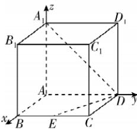
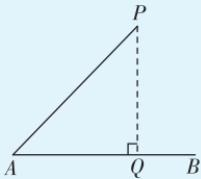

> [!faq]- 答案与解析
>
> > [!success]- **【答案】** A
>
> > [!note]- **【解析】**
> > A 【解析】以 $A$ 为坐标原点, $AB$ , $AD, AA_{1}$ 所在直线分别为 $x$ 轴、 $y$ 轴、 $z$ 轴, 建立空间直角坐标系, 连接 $A_{1}D$ , 如图所示, 则 $A_{1}(0,0,4), D(0,4,0), E(4,2,0)$ , 从而 $\overrightarrow{DA_{1}} = (0, -4, 4), \overrightarrow{DE} = (4, -2, 0)$ , 故点 $A_{1}$ 到直线 $DE$ 的距离是 $\sqrt{\overrightarrow{DA_{1}}^{2} - \left(\frac{\overrightarrow{DA_{1}} \cdot \overrightarrow{DE}}{|\overrightarrow{DE}|}\right)^{2}} = \frac{12\sqrt{5}}{5}$ . 故选 A.
> >
> > 
> >
> > 链接教材 本题是教材第34页例6的变式. 求点 P 到直线 AB 的距离: 连接点 P 和直线 AB 上任意一点, 假设连的是点 A, 则 $d = |\overrightarrow{AP}| \cdot \sin \theta$ (其中 $\theta$ 为 $\overrightarrow{AP}$ 与 $\overrightarrow{AB}$ 的夹角, $\sin \theta = \sqrt{1 - \cos^{2} \theta}$ , $\cos \theta = \frac{\overrightarrow{AP} \cdot \overrightarrow{AB}}{|\overrightarrow{AP}| |\overrightarrow{AB}|}$ ) 或 $PQ = \sqrt{|\overrightarrow{AP}|^{2} - |\overrightarrow{AQ}|^{2}} = \sqrt{\boldsymbol{a}^{2} - (\boldsymbol{a} \cdot \boldsymbol{u})^{2}}$ (其中 Q 是点 P 在直线 AB 上的射影, $\overrightarrow{AP} = a, u$ 为向量 $\overrightarrow{AB}$ 的单位向量).
> >
> > 
