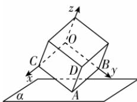

> [!faq]- 答案与解析
>
> > [!success]- **【答案】** C
>
> > [!note]- **【解析】**
> > C 【解析】如图，以 O 为坐标原点，建立空间直角坐标系，则 $O(0,0,0)$ ， $C(3,0,0)$ ， $B(0,3,0)$ ， $A(3,3,0)$ ， $D(3,3,3)$ ，所以 $\overrightarrow{BA} = (3,0,0)$ ， $\overrightarrow{CA} = (0,3,0)$ ， $\overrightarrow{AD} = (0,0,3)$ .
> >
> > 
> >
> > 设平面 $\alpha$ 的法向量为 $\boldsymbol{n}=(x,y,z)$ ，则点 B 到平面 $\alpha$ 的距离为 $d_{1}=\frac{|\overrightarrow{BA}\cdot\boldsymbol{n}|}{|\boldsymbol{n}|}=\frac{|3x|}{\sqrt{x^{2}+y^{2}+z^{2}}}=\sqrt{2}$ ①，点 C 到平面 $\alpha$ 的距离为 $d_{2}=\frac{|\overrightarrow{CA}\cdot\boldsymbol{n}|}{|\boldsymbol{n}|}=\frac{|3y|}{\sqrt{x^{2}+y^{2}+z^{2}}}=\sqrt{2}$ ②，
> >
> > 由①②可得 $|y|=|x|$ , $|z|=\sqrt{\frac{5}{2}}|x|$ , 所以点 D 到平面 $\alpha$ 的距离为 $\frac{|\overrightarrow{AD}\cdot n|}{|n|}=$ $\frac{|3z|}{\sqrt{x^{2}+y^{2}+z^{2}}}=\frac{3\sqrt{\frac{5}{2}}|x|}{\frac{3}{\sqrt{2}}|x|}=\sqrt{5}.$
> >
> > 故选 **C**.
