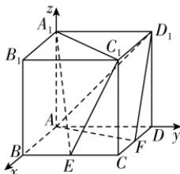

> [!faq]- 答案与解析
>
> > [!success]- **【答案】** B
>
> > [!note]- **【解析】**
> > B 【解析】以点 $A$ 为坐标原点， $AB$ ， $AD, AA_1$ 所在直线分别为 $x, y, z$ 轴建立如图所示的空间直角坐标系，设 $AB = 2$ ，则 $A(0,0,0), B(2,0,0), C(2,2,0), D(0,2,0), A_1(0,0,2), B_1(2,0,2), C_1(2,2,2), D_1(0,2,2), E(2,1,0), F(1,2,0)$ .
> >
> > 设平面 $A_1EC_1$ 的法向量为 $\boldsymbol{m} = (x_1, y_1, z_1), \overrightarrow{A_1C_1} = (2,2,0), \overrightarrow{EC_1} = (0,1,2)$ ，则 $\left\{ \begin{array}{l} \boldsymbol{m} \cdot \overrightarrow{A_1C_1} = 2x_1 + 2y_1 = 0, \\ \boldsymbol{m} \cdot \overrightarrow{EC_1} = y_1 + 2z_1 = 0, \end{array} \right.$ 取 $x_1 = 2$ ，可得 $m = (2,-2,1)$ .
> >
> > 设平面 $AFD_1$ 的法向量为 $\boldsymbol{n} = (x_2, y_2, z_2), \overrightarrow{AF} = (1,2,0), \overrightarrow{AD_1} = (0,2,2)$ ，则 $\left\{ \begin{array}{l} \boldsymbol{n} \cdot \overrightarrow{AF} = x_2 + 2y_2 = 0, \\ \boldsymbol{n} \cdot \overrightarrow{AD_1} = 2y_2 + 2z_2 = 0, \end{array} \right.$ 取 $x_2 = 2$ ，则 $n = (2,-1,1)$ .
> >
> > 对于 A 选项， $\overrightarrow{AF} \cdot \boldsymbol{m} = -2 \neq 0$ ，A 错误；对于 B 选项， $\overrightarrow{D_1F} = (1,0,-2), \overrightarrow{D_1F} \cdot \boldsymbol{m} = 0$ ，且 $D_1F \notin$ 平面 $A_1EC_1$ ，则 $D_1F //$ 平面 $A_1EC_1$ ，B 正确；对于 C 选项， $\overrightarrow{A_1C_1} \cdot \boldsymbol{n} = 2 \neq 0$ ，C 错误；对于 D 选项， $\overrightarrow{A_1E} = (2,1,-2), \overrightarrow{A_1E} \cdot \boldsymbol{n} = 4-1-2 = 1 \neq 0$ ，D 错误。故选 B.
> >
> > 
