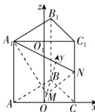

> [!faq]- 答案与解析
>
> > [!success]- **【答案】** A
>
> > [!note]- **【解析】**
> > A 【解析】如图, 取 AC 的中点为 O, 取 $A_{1}C_{1}$ 的中点为 $O_{1}$ , 连接 $OO_{1}, OB$ ,
> > 易知 OC, OB, $OO_{1}$ 两两垂直, 以 O 为
> >
> > 
> >
> > 坐标原点，OC, OB, $OO_{1}$ 所在直线分别为 x, y, z 轴，建立空间直角坐标系 Oxyz，则 $A_{1}(-3,0,6)$ , $M(0,\sqrt{3},0)$ , $N(3,0,3)$ , $B(0,3\sqrt{3},0)$ ，则 $\overrightarrow{A_{1}N}=(6,0,-3)$ , $\overrightarrow{MN}=(3,-\sqrt{3},3)$ , $\overrightarrow{BM}=(0,-2\sqrt{3},0)$ .
> > 设 $\boldsymbol{n}=(x,y,z)$ 为平面 $A_{1}MN$ 的法向量，则 $\left\{\begin{aligned}\overrightarrow{A_{1}N}\cdot\boldsymbol{n}&=6x-3z=0,\\\overrightarrow{MN}\cdot\boldsymbol{n}&=3x-\sqrt{3}y+3z=0,\end{aligned}\right.$ 令 x=1，则 $\boldsymbol{n}=(1,3\sqrt{3},2)$ 是平面 $A_{1}MN$ 的一个法向量，所以点 B 到平面 $A_{1}MN$ 的距离 $d=\frac{|n\cdot\overrightarrow{BM}|}{|n|}=\frac{18}{4\sqrt{2}}=\frac{9\sqrt{2}}{4}$ .
> >
> > 故选 **A**.
