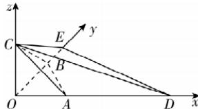

> [!faq]- 答案与解析
>
> > [!success]- **【答案】** D
>
> > [!note]- **【解析】**
> > D
> >
> > 思路导引 根据题中所给线段长度, 可证 OA, OB, OC 两两垂直, 以此建系, 根据条件可得 $\frac{1}{3}m + \frac{2}{3}n + l = 1$ , 设 $3\overrightarrow{OA} = \overrightarrow{OD}, \frac{3}{2}\overrightarrow{OB} = \overrightarrow{OE}$ , 则 $\overrightarrow{OP} = \frac{1}{3}m\overrightarrow{OD} + \frac{2}{3}n\overrightarrow{OE} + l\overrightarrow{OC}$ , 所以 P, C, D, E 四点共面, 求得各点坐标, 进而可得平面 CDE 的一个法向量 n, 根据点到平面距离的向量求法, 即可求得答案.
> >
> > 【解析】因为 OA = OB = 1, $AB = \sqrt{2}$ , 所以 $AB^{2} = OA^{2} + OB^{2}$ , 即 $OA \perp OB$ ,
> >
> > 同理可证 $OA \perp OC, OB \perp OC$ , 即 OA, OB, OC 两两垂直, 建立如图所示的空间直角坐标系.
> >
> > 因为 $m + 2n + 3l = 3$ , 所以 $\frac{1}{3}m + \frac{2}{3}n + l = 1$ , 所以 $\overrightarrow{OP} = \frac{1}{3}m \cdot 3\overrightarrow{OA} + \frac{2}{3}n \cdot \frac{3}{2}\overrightarrow{OB} + l\overrightarrow{OC}$ , 设 $3\overrightarrow{OA} = \overrightarrow{OD}, \frac{3}{2}\overrightarrow{OB} = \overrightarrow{OE}$ , 则 $\overrightarrow{OP} = \frac{1}{3}m\overrightarrow{OD} + \frac{2}{3}n\overrightarrow{OE} + l\overrightarrow{OC}$ , 所以 P, c, d, E 四点共面.
> >
> > 
> >
> > 连接 CD, DE, CE. 因为 $O(0,0,0)$ , $C(0,0,1)$ , $D(3,0,0)$ , $E\left(0,\frac{3}{2},0\right)$ ，所以 $\overrightarrow{CD}=(3,0,-1)$ , $\overrightarrow{DE}=-\left(-3,\frac{3}{2},0\right)$ . 设平面 CDE 的法向量为 $\boldsymbol{n}=(x,y,z)$ ，则 $\left\{\begin{aligned}\boldsymbol{n}\cdot\overrightarrow{CD}=0,\\ \boldsymbol{n}\cdot\overrightarrow{DE}=0,\end{aligned}\right.$ 即 $\left\{\begin{aligned}3x-z=0,\\ -3x+\frac{3}{2}y=0,\end{aligned}\right.$ 取 x=1，则 $\boldsymbol{n}=(1,2,3)$ . 因为 $\overrightarrow{OC}=(0,0,1)$ ，所以线段 OP 长度的最小值为 $\frac{|\overrightarrow{OC}\cdot\boldsymbol{n}|}{|\boldsymbol{n}|}=\frac{3\sqrt{14}}{14}$ . 故选 D.
> >
> > 点悟：点 P 在平面 CDE 上，则线段 OP 长度的最大值为 $O_{2}$ 到平面 CDE 的距离.
