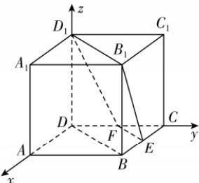

> [!faq]- 答案与解析
>
> > [!success]- **【答案】** D
>
> > [!note]- **【解析】**
> > D 【解析】以 D 为坐标原点, 建立如图所示的空间直角坐标系, 则 $D(0,$
> >
> > $0,0), B(1,1,0), C(0,1,0), E\left(\frac{1}{2},1,0\right), F\left(0,\frac{1}{2},0\right), B_1(1,1,1), D_1(0,0,1)$ ，所以 $\overrightarrow{EB} = \left(\frac{1}{2},0,0\right), \overrightarrow{B_1D_1} = (-1,-1,0), \overrightarrow{B_1E} = \left(-\frac{1}{2},0,-1\right)$ .
> >
> > 
> >
> > 设平面 $EFD_{1}B_{1}$ 的法向量为 $\boldsymbol{n}=(x,y,z)$ ，则 $\left\{\begin{aligned}\boldsymbol{n}\cdot\overrightarrow{B_{1}D_{1}}&=-x-y=0,\\ \boldsymbol{n}\cdot\overrightarrow{B_{1}E}&=-\frac{1}{2}x-z=0,\end{aligned}\right.$ 令 z=1，则 $\boldsymbol{n}=(-2,2,1)$ .
> > 因为 $BD \parallel B_{1}D_{1}, BD \not\subset$ 平面 $EFD_{1}B_{1}, B_{1}D_{1} \subset$ 平面 $EFD_{1}B_{1}$ ,
> > 所以 BD//平面 $EFD_{1}B_{1}$ ，所以直线 BD 到平面 $EFD_{1}B_{1}$ 的距离即为点 B 到平面 $EFD_{1}B_{1}$ 的距离，
> >
> > $\rightarrow$ 敲黑板：线面平行时，线面距等于点面距所以直线 $BD$ 到平面 $EFD_{1}B_{1}$ 的距离为 $d = \frac{|\overrightarrow{EB} \cdot \boldsymbol{n}|}{|\boldsymbol{n}|} = \frac{\left|\frac{1}{2} \times (-2)\right|}{\sqrt{(-2)^2 + 2^2 + 1}} = \frac{1}{3}$ .
> >
> > 故选 **D**.
