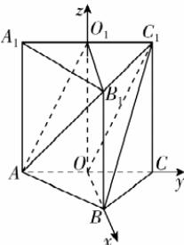

> [!faq]- 答案与解析
>
> > [!success]- **【答案】** $\frac{2\sqrt{5}}{5}$
>
> > [!note]- **【解析】**
> > 如图，因为 $O, O_1$ 分别为 $AC, A_1C_1$ 的中点，所以 $O_1C_1 \parallel AO$ ，且 $O_1C_1 = AO$ ，所以四边形 $AOC_1O_1$ 为平行四边形，所以 $AO_1 \parallel OC_1$ 。又 $AO_1 \not\subset$ 平面 $BC_1O, OC_1 \subset$ 平面 $BC_1O$ ，所以 $AO_1 \parallel$ 平面 $BC_1O$ 。
> >
> > 因为 $OB \parallel O_1B_1, O_1B_1 \not\subset$ 平面 $BC_1O, OB \subset$ 平面 $BC_1O$ ，所以 $O_1B_1 \parallel$ 平面 $BC_1O$ 。
> >
> > 又 $AO_1 \cap O_1B_1 = O_1, AO_1, O_1B_1 \subset$ 平面 $AB_1O_1$ ，所以平面 $AB_1O_1 \parallel$ 平面 $BC_1O$ ，
> >
> > 故平面 $AB_1O_1$ 与平面 $BC_1O$ 之间的距离即为点 $O_1$ 到平面 $BC_1O$ 的距离。
> >
> > 
> >
> > 连接 $OO_{1}$ ，根据题意， $OO_{1} \perp$ 底面 $ABC, OB, AC, OO_{1}$ 两两垂直，则以 $O$ 为坐标原点， $OB, OC, OO_{1}$ 所在直线分别为 $x, y, z$ 轴，建立空间直角坐标系，则 $O(0,0,0), B(\sqrt{3},0,0), C_{1}(0,1,2), O_{1}(0,0,2)$ ，所以 $\overrightarrow{OB} = (\sqrt{3},0,0), \overrightarrow{OC_{1}} = (0,1,2), \overrightarrow{OO_{1}} = (0,0,2)$ . 设 $n = (x,y,z)$ 为平面 $BC_{1}O$ 的法向量，则 $\left\{ \begin{array}{l} n \cdot \overrightarrow{OB} = 0, \\ n \cdot \overrightarrow{OC_{1}} = 0, \end{array} \right.$ 即 $\left\{ \begin{array}{l} x = 0, \\ y + 2z = 0, \end{array} \right.$ 取 $z = -1$ ，可得 $n = (0,2,-1)$ . 设点 $O_{1}$ 到平面 $BC_{1}O$ 的距离为 $d$ ，则 $d = \frac{|n \cdot \overrightarrow{OO_{1}}|}{|n|} = \frac{2}{\sqrt{5}} = \frac{2\sqrt{5}}{5}$ . 故平面 $AB_{1}O_{1}$ 与平面 $BC_{1}O$ 之间的距离为 $\frac{2\sqrt{5}}{5}$ .
> >
> > ## 刷提升
