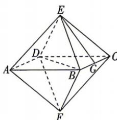

<!-- question-source:start -->
5.[山东师范大学附属中学2026高二期中]正多面体被古希腊圣哲认为是构成宇宙的基本元素,加上它们的多种变体,一直是科学、艺术、

哲学灵感的源泉之一. 如图, 该几何体是一个高为 4 的正八面体, G 为 BC 的中点, 则直线 EG 与平面 BDE 所成角的正弦值为 ( )
A. $\frac{\sqrt{6}}{6}$ B. $\frac{\sqrt{30}}{6}$ C. $\frac{\sqrt{2}}{3}$ D. $\frac{\sqrt{3}}{3}$
<!-- question-source:end -->
