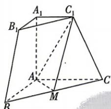

<!-- question-source:start -->
9.[广东东莞四校2026高二联考]如图,在三棱台 $ABC-A_{1}B_{1}C_{1}$ 中,若 $A_{1}A\perp$ 平面ABC,AB⊥AC, $A_{1}C_{1}=1$ ,AB=AC=AA $_{1}=2$ ,M为BC的中点,则平面 $MAC_{1}$ 与平面 $AC_{1}C$ 夹角的余弦值为
A. $\frac{1}{2}$ B. $\frac{2}{3}$ C. $\frac{\sqrt{5}}{3}$

$$
\frac {\sqrt {2}}{2}
$$
<!-- question-source:end -->
