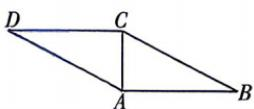
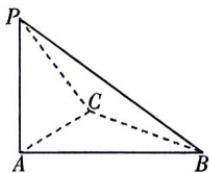

<!-- question-source:start -->
10.[四川南充多校2026高二期中联考]如图①,在平行四边形ABCD中, $AB\perp AC$ ,AB=2AC=4,如图②,沿AC将 $\triangle ACD$ 折起到 $\triangle ACP$ 的位置,使得点P到点B的距离为8,则二面角P-AC-B的余弦值为()

  
图①  
图②

A. $\frac{4}{5}$ B. $-\frac{4}{5}$ C. $\frac{7}{8}$ D. $-\frac{7}{8}$
<!-- question-source:end -->
