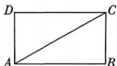
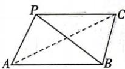

<!-- question-source:start -->
3. 已知矩形 ABCD 中, $AB = \sqrt{3}$ , AD = 1, 将 $\triangle ACD$ 沿 AC 折起到 $\triangle ACP$ 的位置. 若 $PB = \sqrt{3}$ , 则二面角 P-AC-B 的余弦值为 ( )

A. $\frac{2\sqrt{2}}{3}$ B. $\frac{1}{3}$ C. $-\frac{1}{3}$ D. $-\frac{2\sqrt{2}}{3}$
<!-- question-source:end -->
