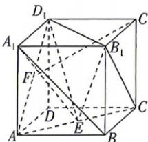

<!-- question-source:start -->
5.(多选)[安徽马鞍山二中等校2026高二联考]如图,正方体 $ABCD-A_{1}B_{1}C_{1}D_{1}$ 的棱长为2,F是线段 $AD_{1}$ 的中点,E是线段AC上的动点,下列结论正确的是()

A. $\overrightarrow{C_1F} = -\overrightarrow{AB} -\frac{1}{2}\overrightarrow{AD} -\frac{1}{2}\overrightarrow{AA_1}$ B.三棱锥 $B_{1} - EA_{1}D_{1}$ 的体积为定值 $\frac{8}{3}$

C. 直线 $A_{1}B$ 与平面 $B_{1}EC$ 所成角的正弦值为 $\frac{\sqrt{6}}{3}$ D. 直线 $CB_{1}$ 与直线 $A_{1}E$ 的夹角的余弦值的取值范围为 $\left[\frac{\sqrt{2}}{2}, \frac{\sqrt{3}}{2}\right]$
<!-- question-source:end -->
