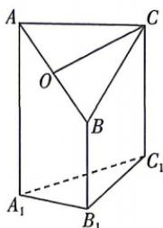

<!-- question-source:start -->
8. 如图是一个直三棱柱(以 $A_{1}B_{1}C_{1}$ 为底面)被一平面所截后得到的几何体, 截面为 $ABC$ . 已知 $A_{1}B_{1}=B_{1}C_{1}=1, \angle A_{1}B_{1}C_{1}=90^{\circ}, AA_{1}=4, BB_{1}=2, CC_{1}=3$ .

(1) 设点 $O$ 是 $AB$ 的中点, 证明: $OC \parallel$ 平面 $A_{1}B_{1}C_{1}$ ;

(2) 求直线 $AB$ 与平面 $AA_{1}C_{1}C$ 所成的角的余弦值；

(3) 求此几何体的体积.

<!-- question-source:end -->
