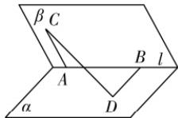

> [!faq]- 答案与解析
>
> > [!success]- **【答案】** B
>
> > [!note]- **【解析】**
> > B 【解析】因为 $\overrightarrow{CD} = \overrightarrow{CA} + \overrightarrow{AB} + \overrightarrow{BD}$ ，所以 $\left|\overrightarrow{CD}\right|^{2} = \left|\overrightarrow{CA}\right|^{2} + \left|\overrightarrow{AB}\right|^{2} + \left|\overrightarrow{BD}\right|^{2} + 2\overrightarrow{CA} \cdot \overrightarrow{AB} + 2\overrightarrow{AB} \cdot \overrightarrow{BD} + 2\overrightarrow{CA} \cdot \overrightarrow{BD}$ 。因为 $\overrightarrow{CA} \cdot \overrightarrow{AB} = 0, \overrightarrow{AB} \cdot \overrightarrow{BD} = 0, AB = 5, AC = 3, BD = 6, CD = 2\sqrt{13}$ ，
> > 所以 $(2\sqrt{13})^{2}=3^{2}+5^{2}+6^{2}+2\times3\times6\cos\langle\overrightarrow{CA},\overrightarrow{BD}\rangle$ 所以 $\cos\langle\overrightarrow{CA},\overrightarrow{BD}\rangle=-\frac{1}{2}.$ 设异面直线 AC 与 BD 所成角为 $\theta$ ， $\theta\in\left(0,\frac{\pi}{2}\right]$ ，
> > 则 $\cos\theta=|\cos\langle\overrightarrow{CA},\overrightarrow{BD}\rangle|=\frac{1}{2}$ ，所以 $\theta=\frac{\pi}{3}$ . 故选 B.
> >
> > 
> >
> > ## 归纳总结 利用数量积求异面直线所成的角的思路
> >
> > <table><tr><td rowspan="4">取向量</td><td>1</td><td>根据题设条件在所求的两条异面直线上取两个方向向量</td></tr><tr><td>2</td><td>异面直线所成的角的问题转化为向量夹角的问题</td></tr><tr><td>3</td><td>利用数量积求向量夹角的余弦值</td></tr><tr><td>4</td><td>异面直线所成的角为锐角或直角,利用向量的夹角求其余弦值应将余弦值加上绝对值,进而求角的大小</td></tr></table>
