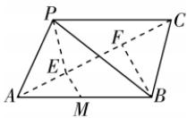

> [!faq]- 答案与解析
>
> > [!success]- **【答案】** C
>
> > [!note]- **【解析】**
> > C【解析】过点 $P$ 作 $PE \perp AC$ ，过点 $B$ 作 $BF \perp AC$ ，垂足分别为 $E, F$ ，过点 $E$ 作 $ME \parallel BF$ 交 $AB$ 于点 $M$ ，则 $ME \perp AC$ ，所以 $\angle PEM$ 即为二面角 $P - AC - B$ 的平面角.由题可得 $PE = BF = \frac{AB \cdot BC}{AC} = \frac{\sqrt{3}}{2}$ ，则 $EA = FC = \frac{1}{2}$ 所以 $EF = 1$ 因为 $\overrightarrow{PB} = \overrightarrow{PE} + \overrightarrow{EF} + \overrightarrow{FB} = -\overrightarrow{EP} + \overrightarrow{EF}+$ $\overrightarrow{FB}$ , 所以 $\overrightarrow{PB^{2}} = \overrightarrow{EP^{2}} + \overrightarrow{EF^{2}} + \overrightarrow{FB^{2}} - 2\overrightarrow{EP} \cdot \overrightarrow{EF} - 2\overrightarrow{EP} \cdot \overrightarrow{FB} + 2\overrightarrow{EF} \cdot \overrightarrow{FB}$ ，即 $3 = \frac{3}{4} + 1 + \frac{3}{4} - 0 - 2 \times \frac{\sqrt{3}}{2} \times \frac{\sqrt{3}}{2} \times \cos \langle \overrightarrow{EP}, \overrightarrow{FB} \rangle + 0$ ，所以 $\cos \langle \overrightarrow{EP}, \overrightarrow{FB} \rangle = -\frac{1}{3}$ .
> > 因为 ME//BF，所以 $\cos\angle PEM=-\frac{1}{3}$ .
> > 所以二面角 P-AC-B 的余弦值为 $-\frac{1}{3}$ . 故选 C.
> >
> > 
