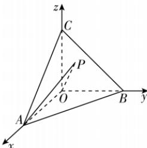

> [!faq]- 答案与解析
>
> > [!success]- **【答案】** B
>
> > [!note]- **【解析】**
> > B
> >
> > 思路导引 设 $OA = OB = OC = 1$ ，以点 $O$ 为坐标原点， $OA, OB, OC$ 所在直线分别为 $x, y, z$ 轴建立空间直角坐标系，设点 $P(a, b, c)$ ，其中 $a, b, c \in [0,1]$ ，利用向量法求出 $a + b + c$ 和 $|\overrightarrow{OP}|$ 的值，然后利用空间向量数量积的运算可求得结果.
> >
> > 【解析】在三棱锥 $O - ABC$ 中，棱 $OA, OB, OC$ 两两垂直且棱长相等，不妨设 $OA = OB = OC = 1$ ，以点 $O$ 为坐标原点， $OA, OB, OC$ 所在直线分别为 $x, y, z$ 轴，建立如图所示的空间直角坐标系，则 $A(1,0,0), B(0,1,0), C(0,0,1)$ ，所以 $\overrightarrow{AB} = (-1,1,0), \overrightarrow{AC} = (-1,0,1)$ .
> >
> > 
> >
> > 设平面 ABC 的法向量为 $\boldsymbol{m} = (x, y, z)$ ，则 $\left\{\begin{aligned}\boldsymbol{m} \cdot \overrightarrow{AB} & = -x + y = 0, \\ \boldsymbol{m} \cdot \overrightarrow{AC} & = -x + z = 0,\end{aligned}\right.$ 取 x = 1，可得 $\boldsymbol{m} = (1, 1, 1)$ .
> > 设点 $P(a, b, c)$ ，其中 $a, b, c \in [0, 1]$ ，连接 AP，因为点 P 在平面 ABC 内，且 $\overrightarrow{AP} = (a - 1, b, c)$ ，所以 $m \cdot \overrightarrow{AP} = a - 1 + b + c = 0$ ，可得 $a + b + c = 1$ .
> > 设直线 OP 与平面 ABC 所成的角为 $\theta$ ，则 $\sin\theta=\sqrt{1-\left(\frac{1}{7}\right)^{2}}=\frac{4\sqrt{3}}{7}$ ，且 $\sin\theta=\frac{|m\cdot\overrightarrow{OP}|}{|m||\overrightarrow{OP}|}=\frac{|a+b+c|}{\sqrt{3}|\overrightarrow{OP}|}=\frac{1}{\sqrt{3}|\overrightarrow{OP}|}=$ $\frac{4\sqrt{3}}{7}$ ，所以 $|\overrightarrow{OP}|=\frac{7}{12}$ . 所以 $|\cos\langle\overrightarrow{OP},\overrightarrow{OA}\rangle|+|\cos\langle\overrightarrow{OP},\overrightarrow{OB}\rangle|+$ $|\cos\langle\overrightarrow{OP},\overrightarrow{OC}\rangle|=\frac{|\overrightarrow{OP}\cdot\overrightarrow{OA}|}{|\overrightarrow{OP}||\overrightarrow{OA}|}+$ $\frac{|\overrightarrow{OP}\cdot\overrightarrow{OB}|}{|\overrightarrow{OP}||\overrightarrow{OB}|}+\frac{|\overrightarrow{OP}\cdot\overrightarrow{OC}|}{|\overrightarrow{OP}||\overrightarrow{OC}|}=\frac{a}{|\overrightarrow{OP}|}+\frac{b}{|\overrightarrow{OP}|}+\frac{c}{|\overrightarrow{OP}|}=\frac{1}{|\overrightarrow{OP}|}=\frac{12}{7}.$
> >
> > 故选 **B**.
