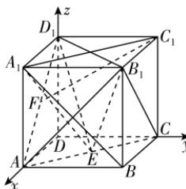

> [!faq]- 答案与解析
>
> > [!success]- **【答案】** ACD
>
> > [!note]- **【解析】**
> > ACD 【解析】对于 A: $\overrightarrow{C_{1}F} = \overrightarrow{C_{1}D_{1}} + \overrightarrow{D_{1}F} = -\overrightarrow{AB} + \frac{1}{2} (\overrightarrow{D_{1}A_{1}} + \overrightarrow{D_{1}D}) = -\overrightarrow{AB} - \frac{1}{2}\overrightarrow{AD} - \frac{1}{2}\overrightarrow{AA_{1}}$ , A 正确.
> > 对于 B: 如图, 连接 $A_{1}C_{1}$ , 因为 $AA_{1} // CC_{1}$ 且 $AA_{1} = CC_{1}$ , 所以四边形 $AA_{1}C_{1}C$ 为平行四边形, 则 $AC // A_{1}C_{1}$ , 因为 $A_{1}C_{1} \subset$ 平面 $A_{1}B_{1}C_{1}D_{1}$ , AC ∉ 平面 $A_{1}B_{1}C_{1}D_{1}$ , 所以 $AC //$ 平面 $A_{1}B_{1}C_{1}D_{1}$ . 因为 $E \in AC$ , 所以点 E 到平面 $A_{1}B_{1}C_{1}D_{1}$ 的距离等于点 A 到平面 $A_{1}B_{1}C_{1}D_{1}$ 的距离, 即 $AA_{1}$ . 又 $S_{\triangle A_{1}B_{1}D_{1}} = \frac{1}{2} \times 2 \times 2 = 2$ , 所以三棱锥 $B_{1}-EA_{1}D_{1}$ 的体积 $V_{三棱锥B_{1}-EA_{1}D_{1}} = V_{三棱锥E-A_{1}B_{1}D_{1}} = \frac{1}{3} S_{\triangle A_{1}B_{1}D_{1}} \times AA_{1} = \frac{1}{3} \times 2 \times 2 = \frac{4}{3}$ , B 错误.
> >
> > 对于 C: 连接 $AB_{1}$ ，以 D 为原点，DA, DC, $DD_{1}$ 所在直线分别为 x, y, z 轴，建立空间直角坐标系，则
> >
> > 
> >
> > $A(2,0,0), B(2,2,0), D(0,0,0), A_{1}(2,0,2), B_{1}(2,2,2), C(0,2,0), D_{1}(0,0,2)$ , 所以 $\overrightarrow{B_1A} = (0,-2,-2), \overrightarrow{B_1C} = (-2,0,-2), \overrightarrow{A_1B} = (0,2,-2)$ . 平面 $B_{1}EC$ 即平面 $B_{1}AC$ , 不妨设平面 $B_{1}AC$ 的法向量为 $m = (x,y,z)$ , 所以 $\left\{ \begin{array}{l} \overrightarrow{B_1A} \cdot m = -2y - 2z = 0, \\ \overrightarrow{B_1C} \cdot m = -2x - 2z = 0, \end{array} \right.$ 令 $x = 1$ , 则 $y = 1, z = -1$ , 则平面 $B_{1}EC$ 的一个法向量为 $m = (1,1,-1)$ . 设直线 $A_{1}B$ 与平面 $B_{1}EC$ 所成的角为 $\theta$ , 则 $\sin \theta = |\cos \langle \overrightarrow{A_1B}, m\rangle| = \frac{|\overrightarrow{A_1B} \cdot m|}{|\overrightarrow{A_1B}| | m|} = \frac{4}{2\sqrt{2} \times \sqrt{3}} = \frac{\sqrt{6}}{3}$ , 故直线 $A_{1}B$ 与平面 $B_{1}EC$ 所成角的正弦值为 $\frac{\sqrt{6}}{3}$ , C 正确. 对于 D: $\overrightarrow{AC} = (-2,2,0), \overrightarrow{AA_1} = (0,0,2), \overrightarrow{CB_1} = (2,0,2)$ , 设 $\overrightarrow{AE} = \lambda \overrightarrow{AC} = (-2\lambda,2\lambda,0), 0 \leqslant \lambda \leqslant 1$ , 则 $\overrightarrow{A_1E} = \overrightarrow{AE} - \overrightarrow{AA_1} = (-2\lambda,2\lambda,-2)$ .
> >
> > 设直线 $CB_{1}$ 与直线 $A_{1}E$ 的夹角为 $\alpha$ ，则 $\cos \alpha = |\cos \langle \overrightarrow{CB_1}, \overrightarrow{A_1E} \rangle| = \frac{|\overrightarrow{CB_1} \cdot \overrightarrow{A_1E}|}{|\overrightarrow{CB_1}| |\overrightarrow{A_1E}|} = \frac{4\lambda + 4}{2\sqrt{2} \times \sqrt{8\lambda^2 + 4}} = \frac{\lambda + 1}{\sqrt{2} \times \sqrt{2\lambda^2 + 1}}.$ 令 $t = \lambda + 1$ ，因为 $0 \leqslant \lambda \leqslant 1$ ，所以 $t \in [1, 2]$ ，则 $\lambda = t - 1$ ，所以 $\cos \alpha = \frac{t}{\sqrt{2} \times \sqrt{2t^2 - 4t + 3}} = \frac{1}{\sqrt{2}} \times \frac{1}{\sqrt{\frac{3}{t^2} - \frac{4}{t} + 2}}.$ 设 $u = \frac{1}{t}$ ，则 $u \in [\frac{1}{2}, 1]$ ，
> >
> > → 避坑：注意换元后新元的取值范围所以 $\cos \alpha = \frac{1}{\sqrt{2}} \times \frac{1}{\sqrt{3u^2 - 4u + 2}} = \frac{\sqrt{2}}{2} \times \frac{1}{\sqrt{3\left(u - \frac{2}{3}\right)^2 + \frac{2}{3}}},$ 由 $u \in [\frac{1}{2}, 1]$ ，得 $3\left(u - \frac{2}{3}\right)^2 + \frac{2}{3} \in [\frac{2}{3}, 1]$ ，则 $\frac{1}{\sqrt{3\left(u - \frac{2}{3}\right)^2 + \frac{2}{3}}} \in [1, \frac{\sqrt{6}}{2}]$ ，所以 $\cos \alpha \in [\frac{\sqrt{2}}{2}, \frac{\sqrt{3}}{2}]$ ，故直线 $CB_{1}$ 与直线 $A_{1}E$ 的夹角的余弦值的取值范围为 $\left[\frac{\sqrt{2}}{2}, \frac{\sqrt{3}}{2}\right]$ ，D 正确。
> >
> > 故选 **ACD**.
