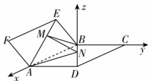

> [!faq]- 答案与解析
>
> > [!success]- **【答案】** C
>
> > [!note]- **【解析】**
> > C【解析】因为四边形ABCD为正方形，所以 $AB\bot BC$ ，则以 $B$ 为原点，直线BA为 $x$ 轴，直线BC为 $y$ 轴，过点 $B$ 且垂直于平面ABCD的直线为 $z$ 轴，建立空间直角坐标系，如图所示.
> >
> > 
> >
> > 设正方形 ABCD 的边长为 m，又 EM = BN，设 $\overrightarrow{EM} = \lambda \overrightarrow{EA}, \overrightarrow{BN} = \lambda \overrightarrow{BD} (\lambda \in [0,1])$ ，则 $B(0,0,0), A(m,0,0), D(m,m,0), E\left(0, -\frac{1}{2}m, \frac{\sqrt{3}}{2}m\right)$ ，所以 $\overrightarrow{EA} = (m, \frac{1}{2}m, -\frac{\sqrt{3}}{2}m), \overrightarrow{BD} = (m, m, 0)$ ，则 $M\left(\lambda m, \frac{1}{2}\lambda m - \frac{1}{2}m, \frac{\sqrt{3}}{2}m - \frac{\sqrt{3}}{2}\lambda m\right)$ ， $N(\lambda m, \lambda m, 0)$ ，所以 $\overrightarrow{MN} = \left(0, \frac{1}{2}\lambda m + \frac{1}{2}m, \frac{\sqrt{3}}{2}\lambda m - \frac{\sqrt{3}}{2}m\right)$ ，则 $|\overrightarrow{MN}| = \sqrt{\left(\frac{1}{2}\lambda m + \frac{1}{2}m\right)^2 + \left(\frac{\sqrt{3}}{2}\lambda m - \frac{\sqrt{3}}{2}m\right)^2}$ $= m\sqrt{\lambda^2 - \lambda + 1} = m\sqrt{\left(\lambda - \frac{1}{2}\right)^2 + \frac{3}{4}}$ 点悟： $m$ 是假设的正方形ABCD的边长，可看作常数，此式是关于 $\lambda$ 的函数所以当 $\lambda = \frac{1}{2}$ 时， $|\overrightarrow{MN}|$ 取得最小值 $\frac{\sqrt{3}}{2} m$ ，此时 $M\left(\frac{1}{2} m, -\frac{1}{4} m, \frac{\sqrt{3}}{4} m\right)$ ， $N\left(\frac{1}{2} m, \frac{1}{2} m, 0\right)$ ，所以 $\overrightarrow{MN} = (0, \frac{3}{4} m, -\frac{\sqrt{3}}{4} m), \overrightarrow{BM} = (\frac{1}{2} m, -\frac{1}{4} m, \frac{\sqrt{3}}{4} m), \overrightarrow{AM} = (-\frac{1}{2} m, -\frac{1}{4} m, \frac{\sqrt{3}}{4} m)$ . 设平面 $AMN$ 的法向量为 $n = (x_1, y_1, z_1)$ ，则 $\left\{ \begin{array}{l} \overrightarrow{AM} \cdot n = 0, \\ \overrightarrow{MN} \cdot n = 0, \end{array} \right.$ 即 $\left\{ \begin{array}{l} -\frac{1}{2} mx_1 - \frac{1}{4} my_1 + \frac{\sqrt{3}}{4} mz_1 = 0, \\ \frac{3}{4} my_1 - \frac{\sqrt{3}}{4} mz_1 = 0, \end{array} \right.$ 令 $z_1 = \sqrt{3}$ ，则 $x_1 = 1, y_1 = 1$ ，即 $n = (1, 1, \sqrt{3})$ 。设平面 $BMN$ 的法向量为 $u = (x_2, y_2, z_2)$ ，则 $\left\{ \begin{array}{l} \overrightarrow{BM} \cdot u = 0, \\ \overrightarrow{MN} \cdot u = 0, \end{array} \right.$ 即 $\left\{ \begin{array}{l} \frac{1}{2} mx_2 - \frac{1}{4} my_2 + \frac{\sqrt{3}}{4} mz_2 = 0, \\ \frac{3}{4} my_2 - \frac{\sqrt{3}}{4} mz_2 = 0, \end{array} \right.$ 令 $z_2 = \sqrt{3}$ ，解得 $x_2 = -1, y_2 = 1$ ，即 $u = (-1, 1, \sqrt{3})$ 。设二面角 $A - MN - B$ 的大小为 $\theta$ ，则 $\cos \theta = -\frac{|n \cdot u|}{|n||u|} = -\frac{|-1\times 1 + 1\times 1 + \sqrt{3}\times\sqrt{3}|}{\sqrt{1^2 + 1^2 + (\sqrt{3})^2}\times\sqrt{(-1)^2 + 1^2 + (\sqrt{3})^2}} = -\frac{3}{5}$ .
> >
> > 故选 **C**.
