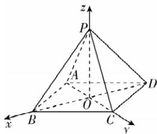
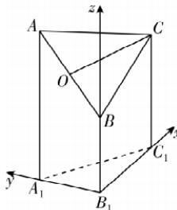

> [!faq]- 答案与解析
>
> > [!success]- **【答案】** $\frac{\pi}{3}$
>
> > [!note]- **【解析】**
> > 设正四棱锥 $P - ABCD$ 底面的边长为 $a$ , 斜高为 $h'$ , 连接 $AC, BD$ 交于点 $O$ , 连接 $OP$ . 则 $4 \times \frac{1}{2} ah' = 2a^2$ , 则 $h' = a$ , $\therefore PO = \sqrt{a^2 - \left(\frac{a}{2}\right)^2} = \frac{\sqrt{3}a}{2}$ . 以 $O$ 为坐标原点, $\overrightarrow{OB}, \overrightarrow{OC}, \overrightarrow{OP}$ 的方向分别为 $x, y, z$ 轴的正方向建立如图所示的空间直角坐标系.
> >
> > 
> >
> > 则 $P\left(0,0,\frac{\sqrt{3}a}{2}\right)$ ， $B\left(\frac{\sqrt{2}a}{2},0,0\right)$ ， $C\left(0,\frac{\sqrt{2}a}{2},0\right)$ ，∴ $\overrightarrow{PC} = \left(0, \frac{\sqrt{2}a}{2}, -\frac{\sqrt{3}a}{2}\right), \overrightarrow{BC} = \left(-\frac{\sqrt{2}a}{2}, \frac{\sqrt{2}a}{2}, 0\right)$ .
> > 设平面 PBC 的法向量为 $m = (x, y, z)$ ，则 $\left\{\begin{aligned}&m \cdot \overrightarrow{PC}=0,\\ &m \cdot \overrightarrow{BC}=0,\end{aligned}\right.$ 即 $\left\{\begin{aligned}\frac{\sqrt{2}a}{2}y-\frac{\sqrt{3}a}{2}z=0,\\-\frac{\sqrt{2}a}{2}x+\frac{\sqrt{2}a}{2}y=0\end{aligned}\right.\Rightarrow\left\{\begin{aligned}z=\frac{\sqrt{6}}{3}y,\\ x=y,\end{aligned}\right.$ $\sqrt{3}$ ，则 $m = (\sqrt{3}, \sqrt{3}, \sqrt{2})$ ，显然平面 ABCD 的一个法向量为 n = (0, 0, 1)，∴ $\cos\langle m, n\rangle = \frac{m \cdot n}{|m||n|} = \frac{0+0+\sqrt{2}}{\sqrt{3+3+2} \times 1} = \frac{1}{2}$ ，∴侧面与底面的夹角的余弦值为 $\frac{1}{2}$ ，又两平面夹角的范围为 $\left[0, \frac{\pi}{2}\right]$ ，∴所求夹角的大小为 $\frac{\pi}{3}$ .
> > （1）【证明】由题可得 $BB_{1} \perp$ 平面 $A_{1}B_{1}C_{1}$ ，又 $A_{1}B_{1}$ ， $B_{1}C_{1} \subset$ 平面 $A_{1}B_{1}C_{1}$ ，所以 $BB_{1} \perp A_{1}B_{1}, BB_{1} \perp B_{1}C_{1}$
> >
> > 又因为 $\angle A_{1}B_{1}C_{1}=90^{\circ}$ ，所以可以以 $B_{1}$ 为坐标原点建立空间直角坐标系，如图①，则 $C_{1}(1,0,$
> >
> > 
> > 图①
> >
> > 3), $A_{1}(0,1,0)$ , $A(0,1,4)$ , $B(0,0,2)$ ，因为 O 是 AB 的中点，
> > 所以 $O\left(0,\frac{1}{2},3\right),\overrightarrow{OC}=\left(1,-\frac{1}{2},0\right)$ 易知 $\boldsymbol{n}=(0,0,1)$ 是平面 $A_{1}B_{1}C_{1}$ 的一个法向量， $\overrightarrow{OC}\cdot n=0$ ，又 OC∉平面 $A_{1}B_{1}C_{1}$ ，所以 OC//平面 $A_{1}B_{1}C_{1}$ .
> >
> > (2)【解】设直线 $AB$ 与平面 $AA_{1}C_{1}C$ 所成的角为 $\theta, \overrightarrow{A_1A} = (0,0,4), \overrightarrow{A_1C_1} = (1,-1,0)$ ，设 $m = (x,y,z)$ 是平面 $AA_{1}C_{1}C$ 的法向量，则由 $\left\{ \begin{array}{l} \overrightarrow{A_1A} \cdot m = 0, \\ \overrightarrow{A_1C_1} \cdot m = 0, \end{array} \right.$ 得 $\left\{ \begin{array}{l} z = 0, \\ x - y = 0, \end{array} \right.$ 取 $x = 1$ ，得 $m = (1,1,0)$ . 又因为 $\overrightarrow{AB} = (0,-1,-2)$ ，所以 $\cos \langle m, \overrightarrow{AB} \rangle = \frac{m \cdot \overrightarrow{AB}}{|m||\overrightarrow{AB}|} = -\frac{\sqrt{10}}{10}$ ，则 $\sin \theta = \frac{\sqrt{10}}{10}, \cos \theta = \frac{3\sqrt{10}}{10}$ ，所以直线 $AB$ 与平面 $AA_{1}C_{1}C$ 所成的角的余
> >
> > $$
