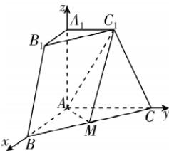

> [!faq]- 答案与解析
>
> > [!success]- **【答案】** B
>
> > [!note]- **【解析】**
> > B 【解析】因为 $A_{1}A \perp$ 平面 ABC，且 $AB, AC \subset$ 平面 ABC，所以 $A_{1}A \perp AB, A_{1}A \perp AC$ ，又 $AB \perp AC$ ，故以 A 为原点，建立如图所示的空间直角坐标系.
> >
> > 
> >
> > 因为 $A_{1}C_{1}=1, AB=AC=AA_{1}=2$ ，且 M 为 BC 的中点，所以 $A(0,0,0)$ ， $M(1,1,0), C_{1}(0,1,2)$ ，则 $\overrightarrow{AM}=(1,1,0), \overrightarrow{AC_{1}}=(0,1,2)$ .
> > 设平面 $MAC_{1}$ 的法向量为 $n=(x,y,z)$ ，则 $\left\{\begin{aligned}\boldsymbol{n}\cdot\overrightarrow{AM}&=x+y=0,\\ \boldsymbol{n}\cdot\overrightarrow{AC_{1}}&=y+2z=0,\end{aligned}\right.$ 取 x=2，可得 y=-2,z=1，所以 $\boldsymbol{n}=(2,-2,1)$ .
> > 易知平面 $AC_{1}C$ 的一个法向量为 $m=(1,0,0)$ . 设平面 $MAC_{1}$ 与平面 $AC_{1}C$ 的夹角为 $\theta$ ，则 $\cos\theta=|\cos\langle\boldsymbol{m},\boldsymbol{n}\rangle|=\frac{|\boldsymbol{m}\cdot\boldsymbol{n}|}{|\boldsymbol{m}||\boldsymbol{n}|}=\frac{2}{1\times3}=\frac{2}{3}$ . 故选 B.
> > 敲黑板：面面角的取值范围是 $\left[0,\frac{\pi}{2}\right]$ ，其余弦值恒为非负，即取法向量夹角的余弦值的绝对值
