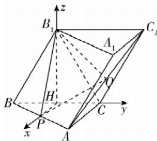

> [!faq]- 答案与解析
>
> > [!success]- **【答案】** （1）
>
> > [!note]- **【解析】**
> > 【证明】取 $BC$ 的中点 $H$ ，连接 $HP,B_{1}H$ ，因为 $H,P$ 分别为 $BC,AB$ 的中点，所以 $HP / / AC$ ，因为 $\triangle B_1BC$ 为等边三角形，所以 $B_{1}H\bot BC.$ 又因为平面 $B_{1}BCC_{1}\bot$ 平面 $ABC$ ，平面 $B_{1}BCC_{1}\cap$ 平面 $ABC = BC,B_{1}H\subset$ 平面 $B_{1}BCC_{1}$ ，所以 $B_{1}H\bot$ 平面 $ABC.$ 又因为 $AC\bot BC,HP / / AC$ ，所以 $HP\bot BC,$ 则 $HP,HC,HB_{1}$ 两两垂直，则以 $H$ 为原点， $HP,HC,HB_{1}$ 所在直线分别为 $x,y,z$ 轴，建立空间直角坐标系，如图所示
> >
> > 
> >
> > 因为 CB=2CA=4，所以 $B_{1}H=2\sqrt{3}$ ，
> > 则 $H(0,0,0)$ ， $A(2,2,0)$ ， $C(0,2,0)$ ， $B(0,-2,0)$ ， $B_{1}(0,0,2\sqrt{3})$ ， $C_{1}(0,4,2\sqrt{3})$ ， $P(1,0,0)$ ， $Q(1,3,\sqrt{3})$ 所以 $\overrightarrow{PQ}=(0,3,\sqrt{3})$ . 易知平面 $BCC_{1}B_{1}$ 的一个法向量为 $n_{1}=(1,0,0)$ .
> > 则 $\overrightarrow{PQ}\cdot n_{1}=0$ , 所以 $\overrightarrow{PQ}\perp n_{1}$ ,
> > 又因为 $PQ\not\subsetneq$ 平面 $BCC_{1}B_{1}$ ,
> > 所以 $PQ//平面 BCC_{1}B_{1}$ .
> > (2)【解】由（1）得， $\overrightarrow{B_{1}P}=(1,0,-2\sqrt{3}),\overrightarrow{PQ}=(0,3,\sqrt{3})$ .
> > 设平面 $B_{1}PQ$ 的法向量为 $n_{2}=(x,y,z)$ ,
> > 则 $\left\{\begin{aligned}&n_{2}\cdot\overrightarrow{PQ}=3y+\sqrt{3}z=0,\\ &n_{2}\cdot\overrightarrow{B_{1}P}=x-2\sqrt{3}z=0,\end{aligned}\right.$ 令 $z=\sqrt{3}$ ，得 x=6, y=-1，
> > 所以 $n_{2}=(6,-1,\sqrt{3})$ .
> > 又因为平面 $BCC_{1}B_{1}$ 的一个法向量为 $n_{1}=(1,0,0)$ ,
> > 所以 $\left|\cos\left\langle n_{1},n_{2}\right\rangle\right|=\frac{\left|n_{1}\cdot n_{2}\right|}{\left|n_{1}\right|\left|n_{2}\right|}=\frac{6}{2\sqrt{10}}=\frac{3\sqrt{10}}{10}$
> >
> > 则平面 $BCC_{1}B_{1}$ 与平面 $B_{1}PQ$ 夹角的余弦值为 $\frac{3\sqrt{10}}{10}$ .
> >
> > ## 刷易错
> >
> > ## ★易错点 忽视向量的夹角与空间角的范围及关系而致错
