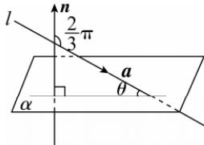

> [!faq]- 答案与解析
>
> > [!success]- **【答案】** C
>
> > [!note]- **【解析】**
> > C 【解析】如图所示, 直线 l 与平面 $\alpha$ 所成的角 $\theta = \frac{\pi}{2} - \left( \pi - \frac{2\pi}{3} \right) = \frac{\pi}{6}$ .
> >
> > 
> >
> > 易错警示 求出斜线的方向向量与平面的法向量所夹的锐角或钝角的补角,取其余角才是斜线与平面所成的角.
