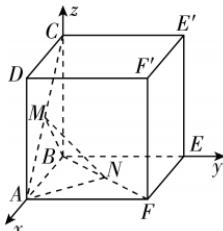

> [!faq]- 答案与解析
>
> > [!success]- **【答案】** B
>
> > [!note]- **【解析】**
> > B 【解析】设正方体的棱长为 1，以 B 为坐标原点，BA, BE, BC 所在直线分别为 x 轴、y 轴、z 轴建立空间直角坐标系 Bxyz，如图所示，则 $M\left(\frac{1}{2}, 0, \frac{1}{2}\right)$ ， $N\left(\frac{1}{2}, \frac{1}{2}, 0\right)$ ， $A(1, 0, 0)$ ， $B(0, 0, 0)$ .
> >
> > 
> >
> > 设平面 AMN 的法向量为 $\boldsymbol{n}_{1} = (x, y, z)$ ，由于 $\overrightarrow{AM} = \left(-\frac{1}{2}, 0, \frac{1}{2}\right)$ ， $\overrightarrow{AN} = \left(-\frac{1}{2}, \frac{1}{2}, 0\right)$ ，则 $\begin{cases} n_{1} \cdot \overrightarrow{AM} = 0, \\ n_{1} \cdot \overrightarrow{AN} = 0, \end{cases}$ 即 $\left\{\begin{aligned}-\frac{1}{2}x+\frac{1}{2}z=0,\\-\frac{1}{2}x+\frac{1}{2}y=0,\end{aligned}\right.$ 令 x=1，解得 y=1, z=1，于是 $n_{1}=(1,1,1)$ ，
> > 同理可求得平面 BMN 的一个法向量为 $\boldsymbol{n}_{2}=(1,-1,-1)$ ，所以 $\cos\langle\boldsymbol{n}_{1},\boldsymbol{n}_{2}\rangle=\frac{\boldsymbol{n}_{1}\cdot\boldsymbol{n}_{2}}{|\boldsymbol{n}_{1}||\boldsymbol{n}_{2}|}=\frac{-1}{\sqrt{3}\times\sqrt{3}}=-\frac{1}{3}$ 设平面 MNA 与平面 MNB 的夹角为 $\theta$ ，则 $\cos\theta=\left|\cos\left\langle n_{1},n_{2}\right\rangle\right|=\frac{1}{3}$ . 故所求两平面夹角的余弦值为 $\frac{1}{3}$ . 故选 B.
> > 易错警示 面面夹角是平面 $\alpha$ 与平面 $\beta$ 相交形成的四个二面角中不大于 $\frac{\pi}{2}$ 的二面角, 故面面夹角 $\theta \in \left[0, \frac{\pi}{2}\right]$ , 因此面面夹角的余弦值一定不小于 0, 故两平面法向量夹角的余弦值的绝对值就是两平面夹角的余弦值, 不用分情况讨论面面夹角是锐角还是钝角, 注意和二面角进行区分.
> >
> > ## 刷提升
