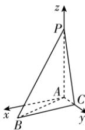

> [!faq]- 答案与解析
>
> > [!success]- **【答案】** B
>
> > [!note]- **【解析】**
> > B 【解析】如图, 以 A 为原点, 过点 A 且平行于 BC 的直线为 x 轴, AC 所在直线为 y 轴, AP 所在直线为 z 轴, 建立
> >
> > 空间直角坐标系. 设 PA = BC = 2AC = 2，则 A(0,0,0), P(0,0,2), B(2,1,0), C(0,1,0)，则 $\overrightarrow{PB} = (2,1,-2)$ , $\overrightarrow{AC} = (0,1,0)$ .
> >
> > 
> >
> > 设异面直线 $PB$ 与 $AC$ 所成角为 $\theta$ ，则 $\cos \theta = \frac{|\overrightarrow{PB} \cdot \overrightarrow{AC}|}{|\overrightarrow{PB}| |\overrightarrow{AC}|} = \frac{|2 \times 0 + 1 \times 1 + (-2) \times 0|}{\sqrt{2^2 + 1^2 + (-2)^2} \times \sqrt{0^2 + 1^2 + 0^2}} = \frac{1}{3}$ . 故选B.
> >
> > 链接教材 本题是教材第38页练习第1题的变式,考查求异面直线所成的角,主要有两种方法:一是向量法,根据几何体的特殊性质建立空间直角坐标系后,分别求出两直线的方向向量,再利用空间向量夹角的余弦公式求解;二是传统法,利用平行四边形、三角形中位线等找出两直线所成的角,再利用平面几何性质求解.
