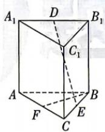
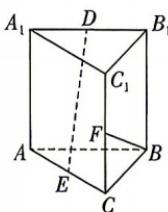
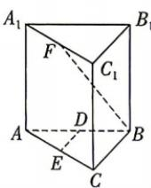

<!-- question-source:start -->
8.[内蒙古部分学校2025高二联考]我国古代数学名著《九章算术》中,将底面为直角三角形,且侧棱垂直于底面的棱柱称为堑堵.已知图①②③都为堑堵, $\angle ABC=\frac{\pi}{2},AB=BC=AA_{1},D,E,F$ 分别是所在棱的中点,则满足 $BF\perp DE$ 的有()

  
图①

  
图②  
图③

A.0个 B.1个C.2个 D.3个
<!-- question-source:end -->
