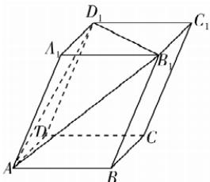

> [!faq]- 答案与解析
>
> > [!success]- **【答案】** D
>
> > [!note]- **【解析】**
> > D 【解析】如图所示.
> >
> > 
> >
> > 在平行六面体 $ABCD-A_{1}B_{1}C_{1}D_{1}$ 中，$\therefore V_{P - ABCD} = \frac{1}{3} S_{\square ABCD}\cdot PA = \frac{1}{3}\cdot$ $|\overrightarrow{AB} |\cdot |\overrightarrow{AD} |\sin \langle \overrightarrow{AB},\overrightarrow{AD}\rangle \cdot |\overrightarrow{AP}| =$ $\frac{1}{3}\times \sqrt{21}\times 2\sqrt{5}\times \frac{4\sqrt{6}}{\sqrt{105}}\times \sqrt{6} = 16.$ $\therefore (\overrightarrow {AB}\times \overrightarrow {AD})\cdot \overrightarrow {AP}$ 的绝对值是四棱锥 $P - ABCD$ 体积的3倍.猜想： $(\overrightarrow {AB}\times \overrightarrow {AD})\cdot \overrightarrow {AP}$ 的绝对值的几何意义是以 $AB,AD,AP$ 为邻边的直四棱柱的体积
> >
> > $AB = AD = AA_{1} = 1, \angle BAD = \angle A_{1}AD = \angle A_{1}AB = 60^{\circ}$ . 设 $\overrightarrow{AB} = a, \overrightarrow{AD} = b, \overrightarrow{AA_{1}} = c$ , 所以 $a \cdot b = b \cdot c = a \cdot c = \frac{1}{2}, \overrightarrow{AB_{1}} = a + c, \overrightarrow{AD_{1}} = b + c$ .
> >
> > 对于 A, $(a - b - c) \cdot (a + c) = a^{2} + a \cdot c - a \cdot b - b \cdot c - a \cdot c - c^{2} = -1 \neq 0$ , 故 A 错误;
> >
> > 对于 B, $(a + b - c) \cdot (a + c) = a^{2} + a \cdot c + a \cdot b + b \cdot c - a \cdot c - c^{2} = 1 \neq 0$ , 故 B 错误;
> >
> > 对于 C, $\left(a + b - \frac{1}{3}c\right) \cdot (a + c) = a^{2} + a \cdot c + a \cdot b + b \cdot c - \frac{1}{3}a \cdot c - \frac{1}{3}c^{2} = 2 \neq 0$ , 故 C 错误;
> >
> > 对于 D, $\left(a + b - \frac{5}{3}c\right) \cdot (a + c) = a^{2} + a \cdot c + a \cdot b + b \cdot c - \frac{5}{3}a \cdot c - \frac{5}{3}c^{2} = 0$ , 且 $\left(a + b - \frac{5}{3}c\right) \cdot (b + c) = a \cdot b + a \cdot c + b^{2} + b \cdot c - \frac{5}{3}b \cdot c - \frac{5}{3}c^{2} = 0$ ,
> >
> > 即 $a + b - \frac{5}{3}c$ 与 $\overrightarrow{AB_{1}}, \overrightarrow{AD_{1}}$ 都垂直, 则 $a + b - \frac{5}{3}c$ 是平面 $AB_{1}D_{1}$ 的一个法向量, 故
> >
> > 敲黑板: 平面的法向量必须与平面
> >
> > 敲黑板: 平面的法向量必须与平面内两个不共线的向量垂直
> > D 正确. 故选 D.
> >
> > ## 课时 2 空间线面位置关系的判定
> >
> > ## 刷基础
