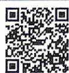
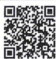

## 2.1.1 倾斜角与斜率及两条直线平行和垂直的判定

  
视频讲解

  
错题本

√ 答案 P131

## 题型1 直线的倾斜角与斜率

![[高中/课堂同步/教辅/必刷题/2027版 必刷题 数学选择性必修第一册RJA/02_第二章_直线和圆的方程/2_1_1_倾斜角与斜率及两条直线平行和垂直的判定/questions/Q00084736.md]]
![[高中/课堂同步/教辅/必刷题/2027版 必刷题 数学选择性必修第一册RJA/02_第二章_直线和圆的方程/2_1_1_倾斜角与斜率及两条直线平行和垂直的判定/questions/Q00084737.md]]
![[高中/课堂同步/教辅/必刷题/2027版 必刷题 数学选择性必修第一册RJA/02_第二章_直线和圆的方程/2_1_1_倾斜角与斜率及两条直线平行和垂直的判定/questions/Q00084738.md]]
![[高中/课堂同步/教辅/必刷题/2027版 必刷题 数学选择性必修第一册RJA/02_第二章_直线和圆的方程/2_1_1_倾斜角与斜率及两条直线平行和垂直的判定/questions/Q00084739.md]]
![[高中/课堂同步/教辅/必刷题/2027版 必刷题 数学选择性必修第一册RJA/02_第二章_直线和圆的方程/2_1_1_倾斜角与斜率及两条直线平行和垂直的判定/questions/Q00084740.md]]
![[高中/课堂同步/教辅/必刷题/2027版 必刷题 数学选择性必修第一册RJA/02_第二章_直线和圆的方程/2_1_1_倾斜角与斜率及两条直线平行和垂直的判定/questions/Q00084741.md]]
![[高中/课堂同步/教辅/必刷题/2027版 必刷题 数学选择性必修第一册RJA/02_第二章_直线和圆的方程/2_1_1_倾斜角与斜率及两条直线平行和垂直的判定/questions/Q00084742.md]]
![[高中/课堂同步/教辅/必刷题/2027版 必刷题 数学选择性必修第一册RJA/02_第二章_直线和圆的方程/2_1_1_倾斜角与斜率及两条直线平行和垂直的判定/questions/Q00084743.md]]
![[高中/课堂同步/教辅/必刷题/2027版 必刷题 数学选择性必修第一册RJA/02_第二章_直线和圆的方程/2_1_1_倾斜角与斜率及两条直线平行和垂直的判定/questions/Q00084744.md]]
![[高中/课堂同步/教辅/必刷题/2027版 必刷题 数学选择性必修第一册RJA/02_第二章_直线和圆的方程/2_1_1_倾斜角与斜率及两条直线平行和垂直的判定/questions/Q00084745.md]]
