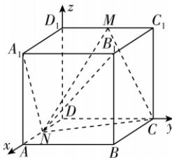

> [!faq]- 答案与解析
>
> > [!success]- **【答案】** BC
>
> > [!note]- **【解析】**
> > BC 【解析】如图, 以 D 为坐标原点, DA, DC, $DD_{1}$ 所在直线分别为 x 轴、y 轴、z 轴建立空间直角坐标系, 设正方体的棱长为 1, $MC_{1} = AN = m (0 < m < 1)$ ,
> >
> > 
> >
> > 则 $C(0,1,0), A(1,0,0), B(1,1,0), A_1(1,0,1), M(0,1-m,1), N(1-m,0,0), B_1(1,1,1)$ .
> >
> > 对于选项 A，因为延长 $A_1N$ 后与 CM 所在平面 $DD_1C_1C$ 相交，故不存在直线 CM 与直线 $A_1N$ 平行，A 错误.
> >
> > 对于选项 B，因为 $\overrightarrow{CM} = (0,-m,1)$ ， $\overrightarrow{NA_1} = (m,0,1)$ ，所以 $\cos \langle \overrightarrow{CM}, \overrightarrow{NA_1} \rangle = \frac{1}{\sqrt{m^2+1}\sqrt{m^2+1}} = \frac{1}{1+m^2}$ ，由 $\frac{1}{1+m^2} = \frac{\sqrt{2}}{2}$ ，可得 $m = \sqrt{\sqrt{2}-1}$ （负值舍去），所以当 $m = \sqrt{\sqrt{2}-1}$ 时，直线 CM 与直线 $A_1N$ 所成的角为 $\frac{\pi}{4}$ ，故 B 正确.
> >
> > 对于选项 C， $\overrightarrow{CN} = (1-m,-1,0)$ ，设平面 CMN 的法向量为 $n = (x,y,z)$ ，则有 $\left\{ \begin{array}{l} n \cdot \overrightarrow{CN} = 0, \\ n \cdot \overrightarrow{CM} = 0, \end{array} \right.$ 即 $\left\{ \begin{array}{l} (1-m)x - y = 0, \\ -my + z = 0, \end{array} \right.$ 令 $y = 1$ ，可得 $n = \left( \frac{1}{1-m}, 1,m \right)$ .
> >
> > 又 $\overrightarrow{A_1B_1} = (0,1,0)$ ，设直线 $A_1B_1$ 与平面 CMN 所成的角为 $\theta$ ，则 $\sin \theta = |\cos \langle \overrightarrow{A_1B_1}, n \rangle| = \frac{1}{\sqrt{\left( \frac{1}{1-m} \right)^2 + 1 + m^2}}$ ，
> >
> > 故当 $m (0 < m < 1)$ 逐渐增大时， $\sin \theta$ 逐渐减小，即直线 $A_1B_1$ 与平面 CMN 所成的角逐渐减小.
> >
> > 当 $m \to 0$ 时， $\sin \theta \to \frac{\sqrt{2}}{2}$ ，即直线 $A_1B_1$ 与平面 CMN 所成的角 $\to \frac{\pi}{4}$ ；当 $m \to 1$ 时，直线 $A_1B_1$ 与平面 CMN 所成的角趋近于直线 $A_1B_1$ 与平面 $DD_1C_1C$ 所成的角，即为 0，所以直线 $A_1B_1$ 与平面 CMN 所成的角的取值范围为 $\left(0, \frac{\pi}{4}\right)$ ，故 C 正确.
> >
> > 对于 D，假设直线 $NB_1$ 与平面 CMN 垂直，则 $n // \overrightarrow{NB_1}$ ，则 $n = \lambda \overrightarrow{NB_1}$ ，即 $\left( \frac{1}{1-m}, 1,m \right) = \lambda (m, 1, 1), \lambda \in \mathbf{R}$ ，这样的 $m$ 不存在，故假设不成立，故 D 错误.
> >
> > 故选 **BC**.
