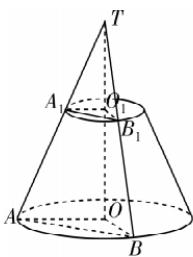
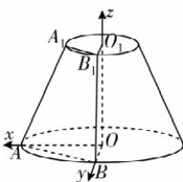

> [!faq]- 答案与解析
>
> > [!success]- **【答案】** (1)
>
> > [!note]- **【解析】**
> > 【证明】 $AA_{1}, BB_{1}$ 为圆台 $OO_{1}$ 的两条母线，延长后交 $OO_{1}$ 所在直线于点 T，连接 $A_{1}O_{1}, O_{1}B_{1}, AO, OB$ ，如图①所示.
> > 由题意易得平面 $A_{1}O_{1}B_{1} \parallel$ 平面 AOB，
> > 又平面 $A_{1}O_{1}B_{1} \cap$ 平面 $ABT = A_{1}B_{1}$ ，平面 $AOB \cap$ 平面 ABT = AB，
> > ∴ $A_{1}B_{1} \parallel AB$ .
> >
> > 
> >
> > 
> > 图①
> > 图②
> >
> > (2)【解】以 $\{OA, OB, OO_{1}\}$ 为正交基底建立空间直角坐标系，如图②所示，则 $A(2,0,0), B(0,2,0)$ ，设 $P(\cos\theta,\sin\theta,h)$ ，不妨设 $Q(-\sin\theta,\cos\theta,h),\theta\in$
> >
> > ## 2.1.1 倾斜角与斜率
