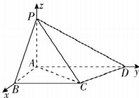

> [!faq]- 答案与解析
>
> > [!success]- **【答案】** (1)
>
> > [!note]- **【解析】**
> > 【证明】∵ $PA \perp$ 底面 ABCD, $AB \subset$ 底面 ABCD, ∴ $PA \perp AB$ ,
> > 又 $AB \perp AD, PA \cap AD = A, PA, AD \subset$ 平面 PAD, ∴ $AB \perp$ 平面 PAD.
> > 又 $AB \subset$ 平面 PAB, ∴ 平面 $PAB \perp$ 平面 PAD.
> > (2)(i)【证明】∵ $PA \perp$ 底面 ABCD, $AD \subset$ 底面 ABCD, ∴ $PA \perp AD$ , 又 $AB \perp AD$ , 则 PA, AB, AD 两两垂直, 故以 A 为坐标原点, AB, AD, AP 所在直线分别为 x, y, z 轴建立如图所示的空间直角坐标系，则由题易知 $A(0,0,0)$ , $B(\sqrt{2},0,0)$ , $C(\sqrt{2},2,0)$ , $D(0,1+\sqrt{3},0)$ , $P(0,0,\sqrt{2})$ .
> >
> > 
> >
> > 设点 O 的坐标为 $(x, y, z)$ , $\therefore OB=\sqrt{(x-\sqrt{2})^{2}+y^{2}+z^{2}}$ $OC=\sqrt{(x-\sqrt{2})^{2}+(y-2)^{2}+z^{2}}$ $OD=\sqrt{x^{2}+(y-1-\sqrt{3})^{2}+z^{2}}$ $OP=\sqrt{x^{2}+y^{2}+(z-\sqrt{2})^{2}}$ ∵ 点 P, B, C, D 均在球 O 的球面上，∴ 由 OB=OC，得 $y^{2}=(y-2)^{2}$ ，解得 y=1；由 OB=OD 且 y=1，得 $(x-\sqrt{2})^{2}+1=x^{2}+3$ ，解得 x=0；由 OB=OP 且 x=0，得 $2+z^{2}=(z-\sqrt{2})^{2}$ ，解得 z=0，
> > ∴ 点 O 的坐标为 $(0,1,0)$ ，故点 O 在平面 ABCD 内.
> > 多种解法 ∵ 点 P, B, C, D 均在球 O 的球面上，
> >
> > ∴ 点 B, C, D 在同一个圆上，设圆心为 $O'$ ，
> > 则点 $O'$ 在 BC 的垂直平分线上.
> > ∵ PA ⊥ 底面 ABCD, AD ⊂ 底面 ABCD, ∴ PA ⊥ AD, 又 AB ⊥ AD, 则 AB, AD, AP 两两垂直, 以 A 为坐标原点, $\overrightarrow{AB}, \overrightarrow{AD}, \overrightarrow{AP}$ 的方向分别为 x, y, z 轴的正方向建立如图所示的空间直角坐标系,
> > 则 $A(0,0,0)$ , $B(\sqrt{2},0,0)$ , $C(\sqrt{2},2,0)$ , $D(0,1+\sqrt{3},0)$ , $P(0,0,\sqrt{2})$ .
> > 设 $O'(x,1,0)$ ,
> > 则 $\overrightarrow{O'B} = (\sqrt{2} - x, -1, 0)$ , $\overrightarrow{O'D} = (-x, \sqrt{3}, 0)$ ，由 $|\overrightarrow{O'B}| = |\overrightarrow{O'D}|$ ，得 $\sqrt{(\sqrt{2}-x)^{2}+(-1)^{2}}=\sqrt{(-x)^{2}+(\sqrt{3})^{2}}$ 解得 x=0, ∴ 点 $O'$ 的坐标为 $(0,1,0)$ ，即 $O'$ 在 AD 上.
> > 又∵ $O'P = \sqrt{PA^{2} + AO'^{2}} = \sqrt{3} = O'D = O'B = O'C$ , ∴ 点 O 与点 $O'$ 重合，
> > ∴ 点 O 在平面 ABCD 内.
> >
> > (ii)【解】由(i)易知 $\overrightarrow{PO}=(0,1,-\sqrt{2}),\overrightarrow{AC}=(\sqrt{2},2,0)$ , $\therefore \cos \langle \overrightarrow{PO}, \overrightarrow{AC} \rangle = \frac{\overrightarrow{PO} \cdot \overrightarrow{AC}}{|\overrightarrow{PO}| |\overrightarrow{AC}|} = \frac{2}{\sqrt{3} \times \sqrt{6}} = \frac{\sqrt{2}}{3}$ ,
> > ∴ 直线 AC 与 PO 所成角的余弦值为 $\frac{\sqrt{2}}{3}$ .
> >
> > 归纳总结 用向量法求异面直线所成角的一般步骤
> > (1) 建立空间直角坐标系；
> > (2) 用坐标表示异面直线的方向向量；
> > (3) 利用向量的夹角公式求出向量夹角的余弦值；
> > (4) 注意异面直线所成角的范围是 $\left(0, \frac{\pi}{2}\right]$ ，即异面直线所成角的余弦值等于两向量夹角的余弦值的绝对值.
> >
> > ## 刷原创
