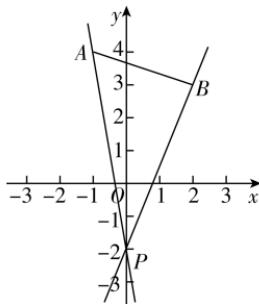

> [!faq]- 答案与解析
>
> > [!success]- **【答案】** D
>
> > [!note]- **【解析】**
> > D 【解析】如图所示, 当直线 l 位于从直线 PB 逆时针旋转到直线 PA 的范围内时才能保证过点 $P(0,-2)$ 的直线 l 与线段 AB 有交点. 直线 l 从 PB 逆时针旋转到 y 轴的过程中, 倾斜角变大到 $\frac{\pi}{2}$ , 斜率从 $k_{PB}$ 增大到正无穷大, 又 $k_{PB} = \frac{-2 - 3}{0 - 2} = \frac{5}{2}$ , 此时直线 l 的斜率的取值范围为 $\left[\frac{5}{2}, +\infty\right)$ ; 直线 l 从 y 轴逆时针旋转到 PA 的过程中, 倾斜角从 $\frac{\pi}{2}$ 开始变大, 斜率从负无穷大增大到 $k_{PA}$ , 又 $k_{PA} = \frac{-2 - 4}{0 - (-1)} = -6$ , 此时直线 l 的斜率的取值范围为 $(-∞, -6]$ . 综上, 直线 l 的斜率的取值范围为 $(-∞, -6] ∪ \left[\frac{5}{2}, +∞\right)$ . 故选 D.
> >
> > 
