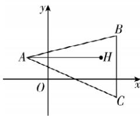

> [!faq]- 答案与解析
>
> > [!success]- **【答案】** D
>
> > [!note]- **【解析】**
> > D 【解析】设 C 点坐标为 $(x, y)$ ，由垂心的性质得 BC ⊥ AH，BH ⊥ AC。由于
> >
> > 
> >
> > 直线 $AH$ 的斜率 $k_{AH} = \frac{2 - 2}{5 + 2} = 0$ ，故直线即 $\left\{\begin{aligned}a&=b,\\ (-\sin\theta-2)a+b\cos\theta+hc=0,\end{aligned}\right.$ 令 a = h，可得 $\boldsymbol{m} = (h, h, \sin \theta + 2 - \cos \theta)$ .
> > ∵ 平面 QAB ⊥ 平面 PAB, ∴ $m \cdot n = 0$ , 即 $2h^{2} + (2 - \cos \theta)^{2} - \sin^{2} \theta = 0$ ,
> > ∴ $2\cos^{2}\theta-4\cos\theta+3+2h^{2}=0,①$ 又 $\cos\theta\in[-1,1],\therefore2\cos^{2}\theta-4\cos\theta+2=2(\cos\theta-1)^{2}\in[0,8]$ 故①无解，从而不存在这样的 h 使得平面 PAB ⊥ 平面 QAB.
> >
> > BC 的斜率不存在, 而点 B 的横坐标为 6, 故 x=6; 由于直线 BH 的斜率 $k_{BH}=\frac{4-2}{6-5}=2$ , 故直线 AC 的斜率 $k_{AC}=\frac{y-2}{6+2}=-\frac{1}{2}$ , 解得 y=-2, ∴ 点 C 的坐标为 $(6,-2)$ .
> >
> > 故选 **D**.
