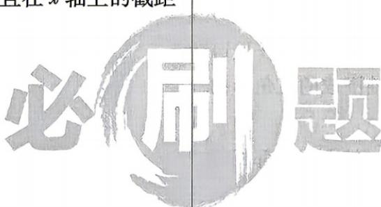

<!-- question-source:start -->
5.[黑龙江哈尔滨九中2025高二期中]已知直线 $l_{1}$ 过点A(2,5)且与直线 $l_{2}:2x+y-4=0$ 平行,则直线 $l_{1}$ 的一般式方程为() A. $2x+y+9=0$ B. $2x+y-9=0$ C. $x+2y+9=0$ D. $x+2y-9=0$

答案 P134
<!-- question-source:end -->
