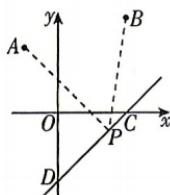

<!-- question-source:start -->
5.[北京师范大学附属实验中学2026高二期中]某工程队准备在一条笔直的公路上的某点处修建一个车站P,使得两车站A,B(可视为

点)到车站 $P$ 的距离相等. 在地图上建立平面直角坐标系, 并按照一定比例确定单位长度, 得到任何的限制, 都是从自己的内心开始。

答案 P137

$A(-2,4), B(4,6)$ ，及公路上的两点 $C(4,0)$ ， $D(0,-4)$ ，则车站 P 的坐标为 \_\_\_\_.
<!-- question-source:end -->
