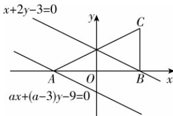

> [!faq]- 答案与解析
>
> > [!success]- **【答案】** C
>
> > [!note]- **【解析】**
> > C 【解析】如图，由 $\triangle ABC$ 的顶点 $A(-3,0)$ ， $B(3,0)$ ， $C(3,3)$ 知， $\triangle ABC$ 的重心为 $\left(\frac{-3+3+3}{3},\frac{0+0+3}{3}\right)$ ，即 $(1,1)$ .
> > 因为 $BC \perp AB$ ，所以 $\triangle ABC$ 为直角三角形，所以外心为斜边 AC 的中点 $\left(\frac{-3+3}{2},\frac{0+3}{2}\right)$ ，即 $\left(0,\frac{3}{2}\right)$ ，
> > 所以可得 $\triangle ABC$ 的欧拉线方程为 $\frac{y-1}{\frac{3}{2}-1}=\frac{x-1}{0-1}$ ，即 $x+2y-3=0$ .
> > 因为直线 $ax + (a - 3)y - 9 = 0$ 与 $x + 2y - 3 = 0$ 平行，所以 $\frac{a}{1} = \frac{a - 3}{2} \neq \frac{-9}{-3}$ ，解得 a = -3。故选 C.
> >
> > 
> >
> > 归纳总结 三角形的“四心”
> > (1)外心:垂直平分线的交点,到各顶点的距离相等.
> > (2)内心:角平分线的交点,到各边的距离相等.
> > (3)重心:中线的交点,重心将中线分成长度之比为2:1的两条线段.
> > (4)垂心:高的交点.
