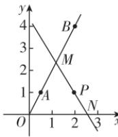

> [!faq]- 答案与解析
>
> > [!success]- **【答案】** $4x + 3y + 1 = 0$
>
> > [!note]- **【解析】**
> > 因为两条直线都过点 $A(4,3)$ ，所以 $4a_{1} + 3b_{1} + 1 = 0$ 且 $4a_{2} + 3b_{2} + 1 = 0$ ，所以过点 $P_{1}(a_{1},b_{1})$ 和点 $P_{2}(a_{2},b_{2})$ 的直线方程为 $4x + 3y + 1 = 0$ .
> >
> > 思路导引 根据题意求出射线所在直线的解析式,设出各点坐标,根据三点共线的斜率关系,求出各点坐标,表示出面积,利用基本不等式,求出面积的最小值.
> >
> > 【解析】如图所示,由点 $A\left(\frac{1}{2},1\right)$ , $B(2,4)$ , 得直线 AB 的方程为 y=2x. 由题意得点 M 在射线 AB
> >
> > 
> >
> > 上，设点 $M(t,2t)\left(t > \frac{1}{2}\right)$ ，点 $N(n,0)$ ，
> > 起点是 $A$ ，故点 $M$ 不能在点 $A$ 下方 $n > 0$ .
> > 由 $M,N,P$ 三点共线和点 $P(2,1)$ 可知，当 $t \neq 2$ 时， $\frac{2t - 1}{t - 2} = \frac{0 - 1}{n - 2}$ ，解得 $n = \frac{2 - t}{2t - 1} + 2 = \frac{3t}{2t - 1}$ ，此时 $\triangle MON$ 的面积为 $S_{\triangle MON} = \frac{1}{2} \cdot 2t \cdot \frac{3t}{2t - 1} = \frac{3t^2}{2t - 1}$ . 令 $2t - 1 = u(u > 0, u \neq 3)$ ，即 $t = \frac{u + 1}{2}$ ，则 $S_{\triangle MON} = \frac{3\left(\frac{u + 1}{2}\right)^2}{u} = \frac{3u}{4} + \frac{3}{4u} + \frac{3}{2} \geqslant 2\sqrt{\frac{3u}{4} \cdot \frac{3}{4u}} +$ $\frac{3}{2} = 3$ ，当且仅当 $\frac{3u}{4} = \frac{3}{4u}$ 即 $u = 1$ 时等号成立.故当 $t = 1$ 时， $S_{\triangle MON}$ 取最小值3.当 $t = 2$ 时， $M(2,4),N(2,0)$ $P(2,1)$ ，此时 $S_{\triangle MON} = \frac{1}{2}\times 4\times 2 = 4 > 3.$ 综上， $S_{\triangle MON}$ 的最小值为3.
