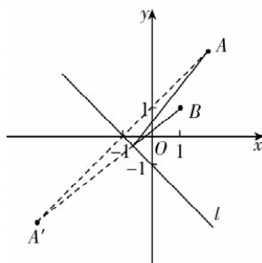

> [!faq]- 答案与解析
>
> > [!success]- **【答案】** D
>
> > [!note]- **【解析】**
> > D 【解析】直线 $l_{1}:2x-y+1=0$ 与 x 轴交于点 A，令 y=0 得 $x=-\frac{1}{2}$ ，即 $A\left(-\frac{1}{2},0\right)$ 。直线 $l_{2}:x-3y-3=0$ 与 x 轴交于点 B，令 y=0 得 x=3，即 $B(3,0)$ 。由 $\left\{\begin{aligned}&2x-y+1=0,\\&x-3y-3=0\end{aligned}\right.$ 得 $\left\{\begin{aligned}&x=-\frac{6}{5},\\&y=-\frac{7}{5},\end{aligned}\right.$ 则直线 $l_{1}$ 与 $l_{2}$ 的交点 P 为 $\left(-\frac{6}{5},-\frac{7}{5}\right)$ ，则 $\overrightarrow{PA}=\left(\frac{7}{10},\frac{7}{5}\right)$ ， $\overrightarrow{PB}=\left(\frac{21}{5},\frac{7}{5}\right)$ ，则
> >
> > $3=\frac{1+3}{1+4}(x+4)$ ，即 $4x-5y+1=0$ .
> > → 敲黑板：根据光线反射的概念可知，反射光线所在直线过点 $A'$
> >
> > 
> >
> > $\cos \langle \overrightarrow{PA},\quad \overrightarrow{PB}\rangle = \frac{\overrightarrow{PA} \cdot \overrightarrow{PB}}{|\overrightarrow{PA}| |\overrightarrow{PB}|} = \frac{\frac{147}{50} + \frac{49}{25}}{\sqrt{\frac{49}{100} + \frac{49}{25}} \times \sqrt{\frac{441}{25} + \frac{49}{25}}} = \frac{\sqrt{2}}{2}$ , 又 $\langle \overrightarrow{PA},\overrightarrow{PB} \rangle \in [0, \pi]$ , 则 $\langle \overrightarrow{PA},\overrightarrow{PB} \rangle = \frac{\pi}{4}$ , 则 $\angle APB = \frac{\pi}{4}$ .
> >
> > 故选 **D**.
