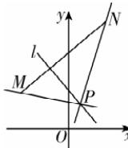

> [!faq]- 答案与解析
>
> > [!success]- **【答案】** C
>
> > [!note]- **【解析】**
> > C 【解析】由 $l: mx + y - m - 2 = 0$ ，得 $m(x - 1) + y - 2 = 0$ ，设其过定点 P.
> >
> > 令 $\left\{\begin{aligned}x-1&=0,\\ y-2&=0,\end{aligned}\right.$ 解得 $\left\{\begin{aligned}x&=1,\\ y&=2,\end{aligned}\right.$ 则直线 l 经过定点 $P(1,2)$ . 所以 $k_{PM}=\frac{3-2}{-4-1}=-\frac{1}{5},$ $k_{PN}=\frac{9-2}{3-1}=\frac{7}{2}.$ 如图，设直线 l 的斜率为 k，则 $k\geqslant\frac{7}{2}$ 或 $k\leqslant-\frac{1}{5}$ ，即 $-m\geqslant\frac{7}{2}$ 或 $-m\leqslant-\frac{1}{5}$ ，解得 $m\leqslant-\frac{7}{2}$ 或 $m\geqslant\frac{1}{5}$ ，故选 C.
> >
> > 
