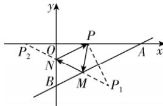

> [!faq]- 答案与解析
>
> > [!success]- **【答案】** $4\sqrt{5}$
>
> > [!note]- **【解析】**
> > 由题知直线 $AB$ 的方程为 $\frac{x}{8} +\frac{y}{-4} = 1$ ，即 $x - 2y - 8 = 0$
> >
> > 
> >
> > 如图,设点 $P(3,0)$ 关于直线 AB 的对称点为 $P_{1}(a,b)$ ,
> > 则 $\left\{\begin{aligned}\frac{b}{a-3}&=-2,\\ \frac{a+3}{2}&-2\cdot\frac{b}{2}-8=0,\end{aligned}\right.$ 解得 $\left\{\begin{aligned}a&=5,\\ b&=-4,\end{aligned}\right.$ 即 $P_{1}(5,-4)$ .
> > 又点 $P(3,0)$ 关于 y 轴的对称点为 $P_{2}(-3,0)$ ,
> > 所以由光的反射规律以及几何关系可知，光线所经过的路程是 $|PM| + |MN| + |NP| = |P_{1}P_{2}| = \sqrt{(5+3)^{2} + (-4-0)^{2}} = 4\sqrt{5}$ .
