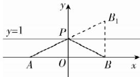

> [!faq]- 答案与解析
>
> > [!success]- **【答案】** C
>
> > [!note]- **【解析】**
> > C 【解析】 $f(x) = \sqrt{x^{2} + 4x + 5} + \sqrt{x^{2} - 4x + 5} = \sqrt{(x + 2)^{2} + 1} + \sqrt{(x - 2)^{2} + 1} = \sqrt{(x + 2)^{2} + (1 - 0)^{2}} + \sqrt{(x - 2)^{2} + (1 - 0)^{2}}$ 表示动点 $P(x,1)$ 到定点 $A(-2,0)$ 和 $B(2,0)$ 的距离之和，因为点 $P(x,1)$ 在直线 $y = 1$ 上运动，作 $B(2,0)$ 关于直线 $y = 1$ 的对称点 $B_{1}$ ，则 $B_{1}(2,2)$ 故 $\mid PA\mid +\mid PB\mid = \mid PA\mid +\mid PB_1\mid \geqslant$ $|AB_{1}| = \sqrt{(2 + 2)^{2} + (2 - 0)^{2}} = 2\sqrt{5}$ 当且仅当 $A,P,B_{1}$ 三点共线时取等号，故 $f(x)$ 的最小值是 $2\sqrt{5}$ .故选C.
> >
> > 
